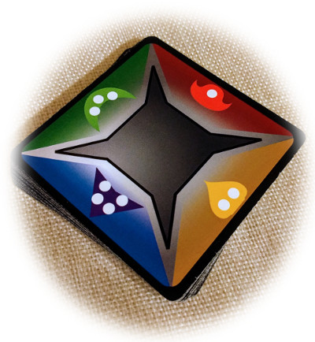

# The Deckahedron

The **Deckahedron** is a deck of 20 square cards.

These cards are designed to be used with role-playing games, for actions
where typically dice are used.

## Problem : Arithmetic Is Annoying

In **Dungeons and Dragons**, to see if your character succeeds or
fails at an action, typically you would role a 20-sided die (d20), then take
the resulting value and add or subtract bonuses or penalties for a new value,
and then check that new value against a *difficulty value*.

Many other role-playing games follow the same formula.  Roll, add/subtract,
compare to the difficulty of the action.

In this way, the odds of success fall along a statistical "curve".

The downside is all the arithmetic. Though the process can be learned and
mastered to the point where it seems like an afterthought to practiced players,
it can be annoying for new players.  Even players familiar with the mechanic
sometimes complain that the mental math breaks the "flow" of the game.

The Deckahedron is designed to replace this process with a simpler one.
Typically, the new process is:

 * Flip a card
 * The result of the action is successful if ✔ are shown
 * The result of the action is failure if ✗ are shown

This works because the statistical curve is "baked-in" to the deck of 20
cards.

## How much is possible

[TODO]

## Critical Successes and Critical Failures

[TODO]

## Using the Deckahedron as a d6 or d4

[TODO]

## Statistics

[TODO]
