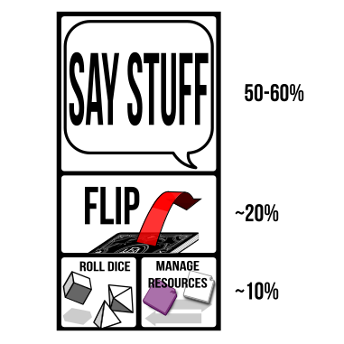
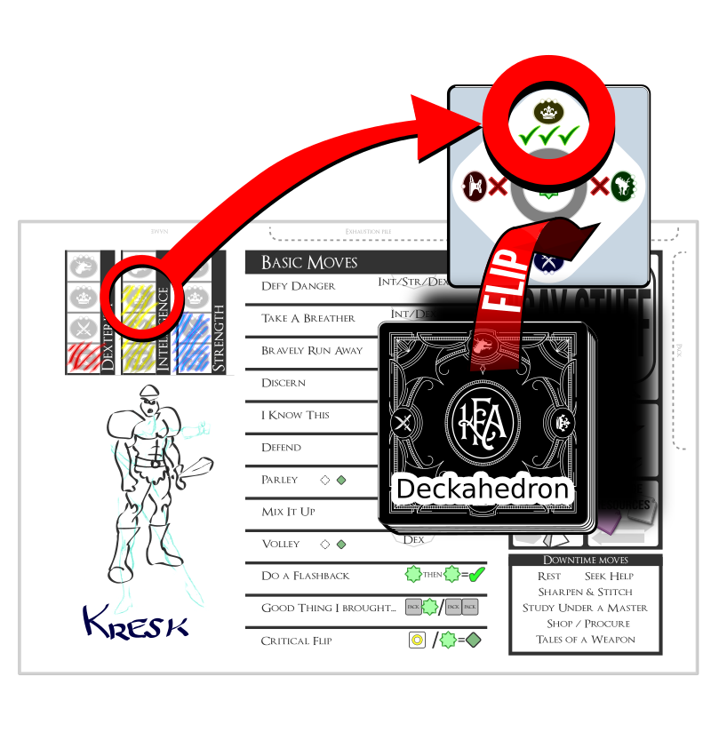
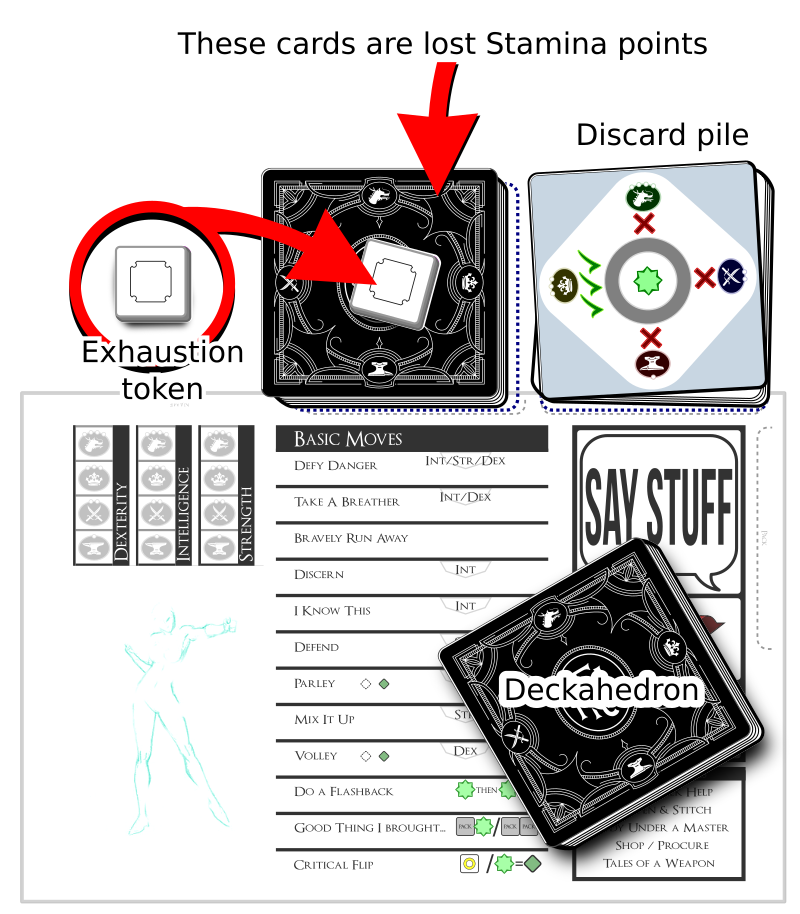
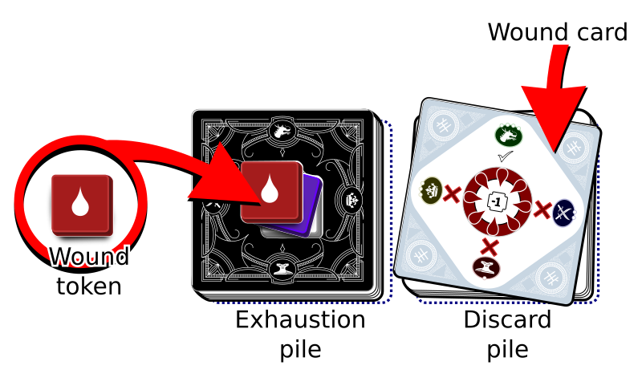
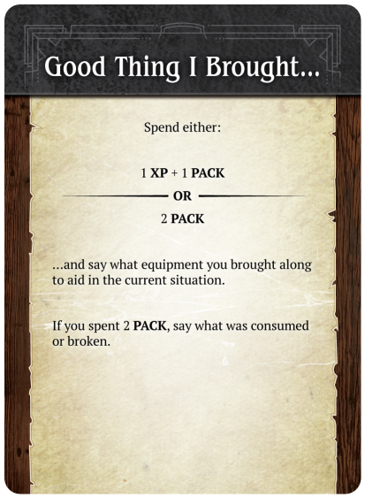
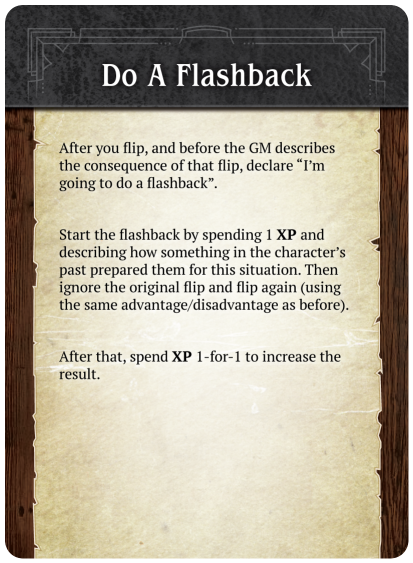
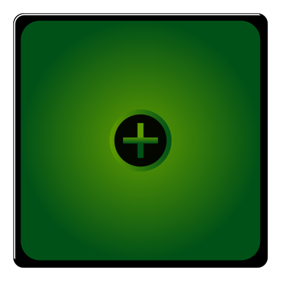
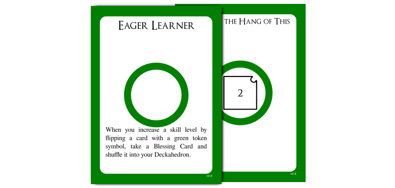

# Deckahedron World - Player's Guide

# Tagline

Like board games?  Remember Dungeons & Dragons? Think you can improv?
Welcome to Deckahedron World!

# Welcome to Role-Playing

Deckahedron World is a system for telling a story.  The authors of the story
are you and your friends, sitting around a table.

This story is improvisational, interactive, and collaborative.

The rewards for playing are laughter and excitement while you play, and
warm conversations for years afterwards that start with "Remember that time
we were playing Deckahedron World and..."

## How to make a great story

Imagine the audience for this story is the inner children of all the players.
What evokes the feelings we had when we were children playing pretend? Can
you remember being 11 years old and watching a spectacular Steven Spielberg
movie?  Or maybe a cheap-but-awesome Sam Raimi movie?

You are going to collaborate with all the other players to make this story,
so when you add your parts, think of what will give your friends around the
table a thrill, put them in suspense, ratchet up their feelings of tension,
or make their jaws drop with awe.

Sometimes inner children get a big kick out of blood and guts.
Your inner child might giggle at the brothel scenes in HBO's Game of
Thrones. If you don't know what topics your friends consider "off-limits",
it is a good idea to ask and tell before you start playing.

The story that emerges from Deckahedron World is not a precisely crafted
thing. That's ok. It doesn't have to be high art or even a cartoon on Adult
Swim. It gets shaped by each player, and when your turn comes, you
adapt, do your best improvisational
["Yes, and"](https://en.wikipedia.org/wiki/Yes%2C_and...)
, and see where it goes from there.
It might sound like chaos, but with some faith in your friends, you
will delight at how the plot solidifies, and how real the characters
become.

## Specifically, What to do

In a game of Deckahedron World, one person will take on the role of the
Game Master, or "GM".  The other people will be called simply "Players".

### The GM

The GM's job is to know all the rules, and say stuff.  Occasionally
they will write notes and scribble some quick numerical facts.

The GM's domain is the world.

### The Players

Player, your domain is your character.

{ width=2.5inch }

Most of your time will be spent saying stuff. You are part of a conversation.
Ask questions, use your imagination, chime in when someone inspires you.
Think about your character like a hero of a movie, and try playing as
the writer of the movie, or the director, or immerse yourself like a method
actor standing in the character's shoes and seeing with their eyes.

Deckahedron World invites you to:

 * Describe your character and their actions
   * Act out their dialogue
   * Describe *how* they act
      - flourishes and stunts
      - their facial expressions, voice, and body language
   * Tell what they say / hear / see / smell / taste / feel
   * Describe their thoughts & memories
   * Chime in when they interact with or support the other characters
 * Tell parts of the story
   * Tell your character's backstory
   * Command your character's hirelings and animal companions
   * Refer to your **moves** to generate more ideas and see what boundaries you can push

As the conversation unfolds, the rules will chime in as well.  When that
happens you will be called do things beyond just "saying stuff":

 * Flip your Deckahedron
 * Move tokens around
 * Roll dice

This guide will teach you how to do those things.

# The Deckahedron

Every player except the GM gets a Deckahedron. Inspect your Deckahedron.
You should have 20 cards.  There are 4 symbols, or "suits", on the fronts and
backs of the cards:

Name      | symbol                                  | odds                              | color  | rank
----------|-----------------------------------------|-----------------------------------|--------|-------
Anchor    | { width=0.5inch }     | indicates the weakest odds        | red    | rank 1
Bulb      | { width=0.5inch }         | indicates below average odds      | yellow | rank 2
Crescent  | { width=0.5inch } | indicates above average odds      | green  | rank 3
Dart      | { width=0.5inch }         | indicates the best odds           | blue   | rank 4

Shuffle your Deckahedron and place it face-down in front of you.

Whenever your character attempts something risky, where the outcome is
not certain, the GM calls on you to use your Deckahedron and "flip".

First, the GM names the move you're attempting and which of your
character's attributes -- Strength, Dexterity, or Intelligence -- you
use to resolve the flip.

    GM Note: The attributes used to resolve a move are listed at the top
    of each card.  Sometimes a card gives the option of several
    attributes, like "Str / Dex".  You may need to ask the player for more
    detail about what they are attempting before calling for a flip.

{ width=2.5inch }

Look at the attribute on your character sheet -- what symbol is it, Anchor,
Bulb, Crescent, or Dart?
Take the top card and flip it face up.
Put it down so that the symbol faces the GM.
(Saying "Bam!" or making some other sound effect is optional.)

{ width=2.5inch }

The top of the flipped card shows ✗s or ✔s.
These tell you the result of the move.
Consistently facing the result towards the GM helps simplify the GM's
bookkeeping and helps the game stay fast-paced.

{ width=2.5inch }

Finally, find the move card named by the GM and read its instructions.
It tells you how the GM should interpret the ✗s and ✔s.

Afterward, any card used during a flip goes face-up in a *discard pile*.
Later, you will start another pile of face-up cards called an
*Exhaustion pile*.  Keep them separate.

Note: some move cards give you or the GM a choice between several options.
If one of the options is impossible (fictionally or mechanically), it may
not be chosen. Choose one of the other options instead.

## For example,

You're playing a character named Kresk.  You say:

> Kresk sees the pit of spikes in front of him, but isn't scared.
> He just takes a running start and mightily leaps over the pit,
> landing safely on the other side.

The GM might say to you:

> Ok, sounds good, but let's see if Kresk's legs are strong enough.
> Please flip Defy Danger with your Strength.

Look over at the character sheet and see that Kresk has rank 3
(Crescent) Strength. Flip over the top card of your Deckahedron and
look for that Crescent symbol.

Maybe you get a single ✔. The GM uses the instructions on the
Defy Danger card ("You do it, but there's a new complication") to
improvise what happens next:

> You leap through the air, landing with a thud on the other
> side of the pit, kicking up a cloud of dust on this forgotten
> jungle trail. Rising to your feet, you notice that more than
> dust has been stirred. The sounds of movement and a threatening
> rattle alerts you to something approaching from inside the pit.
> What do you do?

## Other ways to flip: Advantage / Disadvantage

Some flips are a little more complicated. Some moves in Deckahedron
World instruct you to "take +1 advantage", "add an advantage card"
or "flip with advantage". Sometimes you are given the opposite
instruction, "add a disadvantage card" or "flip with disadvantage".

### Advantage

With an advantage, flip over your top card as usual, and then
flip over the next card as well.
Compare the results (the number of ✗s or ✔s next to the relevant symbol)
and *resolve the flip* with the card that has the **best** result.

If it's a tie, you may choose whichever card to be the card that *resolves
the flip*.

All cards that got flipped go face-up in your *discard pile*.

#### Complete Flip Rule

You must flip over all the cards you were instructed to, even if the first
card shows ✔✔.

### Disadvantage

With a disadvantage, do the same thing, but use the **worst** result.

### Multiple Advantages / Disadvantages

For a given flip, you may be instructed to add two advantage cards or two
disadvantage cards.  This means you flip **3 cards in total** and take
the **best** or **worst**, respectively.

No flip may use more than 3 cards in total, so adding advantage cards
beyond 2 is just ignored.

Sometimes there's a situation where you are instructed to both
"flip with advantage" and "flip with disadvantage".
To resolve any of these combinations,
simply add up all the advantages, and then subtract all the disadvantages
to arrive at your sum of advantage or disadvantage.
The maximum is still two extra cards, so if the sum is -3, you only
flip with two disadvantage cards.

## Other flip complications: Green token cards

{ width=2.5inch }

Some Deckahedron cards have a green token symbol in the middle.
After a flip is resolved by a card showing a green token symbol,
you have a choice:

 * Take a green token from the supply
 (these may be spent later to perform certain moves)
 * Go up one level in the move just performed
 (see [Move Levels](#move_levels))

You may only do this when the card *resolves* a flip. (ie, when flipping
multiple cards, only if the *green token card* was the one from which
the ✗ or ✔ symbols were used to interpret the result of the move)

Green tokens are a currency you spend to activate "meta" parts of the game.
See below for moves that let you "break" or "bend" rules, or partially take
control of the narrative.

## Other flip complications: Wound cards

Sometimes you flip over a wound card and must lose a Stamina point. See the
[Combat chapter](#combat).

## Reshuffling

At any time before a flip, or after a flip is resolved, you may take your
*discard pile* and shuffle it back into your Deckahedron.

Whenever your Deckahedron is down to 5 or fewer cards, you **must** take
your *discard pile* and shuffle it back into your Deckahedron.

## Interpreting the result of a flip

When a player performs a move, the player executes a flip, and the GM
interprets the narrative result, based on the text of the move card.

{ width=2.5inch }

Usually ✔✔ means an unfettered success, and single ✔ means success,
but with complication.

When the result is a single ✗, it sometimes means the same as a single ✔,
but often it is slightly worse.

Any time a flip results in a single ✗ the GM should add a point to
the *Bad Bank*.  -- even when the move card says it has the same narrative
effect as a single ✔.

When the result is ✗✗, it is the GM's turn to make a move. The GM narrates
the consequences of the move the player just attempted and has license to
take the narrative where they like.

See the GM Guide for explanations of the *Bad Bank* and for a list of moves
the GM is allowed to make.

### Exceptions on ✗ and ✗✗ flips

Sometimes a card does not say how a ✗ should be interpreted. In that case,
the GM gets to make a move, just like ✗✗.

Rarely, a card will have instructions for how to interpret a ✗✗ result.
These instructions should be executed, but might only be *part* of the
GM's move -- the GM gets to decide if they have more to add.

When the move card has the tag *IMMEDIATE*, the GM does not get to make a
move on a ✗✗. Instead, the GM should just add 2 points to the *Bad Bank*.

## Flips only happen when the situation is uncertain or risky

A GM only calls for a flip when the situation is uncertain or risky for
the character. If the outcome is certain, the GM may just narrate what
happens. Or they may ask you some clarifying questions.

Deckahedron World is a conversation. Different GMs will draw the line
of certainty at different places.

Consider a situation where the GM has described your character, Kresk,
waking up after making camp in a forest. Beside you is a squirrel nibbling
an acorn.

You might respond by saying,

"Kresk wants that acorn! I Hack and Slash the squirrel!"

It would be bizarre, but completely within the rules for the GM to write
up some stats for the squirrel (1 Stamina, 1 attack power), and begin a
melee combat between Kresk and the squirrel, and ask you to flip Strength
to resolve the Hack and Slash move.

But the GM will more likely interpret your action, as described, as having
a certain outcome. Perhaps the GM will respond:

 * "As you raise your fist to smash the squirrel, it darts off into the
   forest, never to be seen again."
 * "How is Kresk going to overcome the squirrel's natural speed and reflexes?"
 * "You smash your fist down and flatten the rodent. Strangely, it didn't
   even flinch. Does this odd behaviour remind Kresk of the rumors he heard
   about this forest being enchanted?"

### Pushing buttons or staying in character

The GM doesn't always have to invoke a move and call for a flip.  But in
this example, the player literally names a move ("I Hack and Slash...").
That's a strong signal to the GM, and the GM is likely to follow strong
signals.

If you enjoy playing in a style where things flow like a conversation or
a story, from question to answer, from description to dialogue and back
around again, rather than pushing a limited set of buttons laid out in
front of you, try playing without naming the moves. Just describe what your
character does in a natural way.

"Kresk wants that acorn! I slam my fist down on the squirrel!"

# Combat - Stamina/Harm/Wounds

Here are rules to determine when your character is able to endure
exertion and injury to keep moving forward or when they're completely
spent and collapsed in a heap.

When a character is in a fight, they are running, dodging, striking, and
being struck and assailed by their foe.  All of this stuff is scary and
exhausting. So a character gets weaker the longer they're in this
exchange, even if they're able to dodge every blow.

This weakening is represented by cards from your Deckahedron being lost
into your *Exhaustion pile*.

Think of a boxing match or a mixed martial arts match. During the later
rounds, the athletes are worn down, don't jump around the ring with as
much vigor, and drop their guard more frequently. The contest is not
always decided with a knockout punch, it often comes down to who can
better endure the exertion.

By default, your character has 10 Stamina points. When your character
loses all 10, they are incapacitated.

## Phases

When your character gets attacked or falls victim to some other danger,
you have choices about exactly how they are affected. They may dodge,
and just lose Stamina, they may stand stubbornly against a blow,
taking Harm to perhaps absorb the blow with their armour (or with their
face), or they may be wounded by the attack.

The **first phase** is rolling dice to arrive at a number. This number
is called the *attack power*.

The **second phase** is deciding how to split that number among 3
categories, Stamina, Harm, or Wounds.

The **third phase** is optional: absorbing some points using any relevant
move cards and item cards.

Finally, the **fourth phase**: you interpret those results into the
narrative.  Did your character dive into the dirt?  Did they take a punch
to the jaw and respond with a bloodied grin?  Did the spear bounce right
off their steel breastplate?

### First Phase

When your character suffers the consequences of violence, you roll dice to get
a number. This number is called the *attack power*.

### Second Phase

If you don't split up the *attack power*, you will simply lose that many
Stamina points.

Let's say your character was attacked with a sword and the dice were rolled
and summed up to 7. You can either lose 7 Stamina points, or choose to split
it up.

Let's say you already lost 3 Stamina points earlier. You only have 7 Stamina
points left, and you don't want your character to be incapacitated. You have
a couple options:

 * Turn *attack power* into Harm tokens at a rate of 3-for-1
 * Turn *attack power* into Wound tokens at a rate of 6-for-1

For example, you may split the attack power of 7 into:

 * 4 Stamina points
 * 1 Harm token

You may even do that twice, splitting the attack power of 7 into:

 * 1 Stamina point
 * 2 Harm tokens

Another option is to take a Wound, using a rate of 6-for-1.
In our example, you may split the attack power of 7 into:

 * 1 Stamina point
 * 1 Wound token

Note: as described later, taking Wound and Harm tokens can sometimes also
cause loss of Stamina points.

*Attack power* turns into Harm tokens at *exactly* a rate of 3-to-1, and
Wound tokens at *exactly* a rate of 6-to-1. You cannot choose a Harm token
if facing an attack power of 2.

## Stamina / Exhaustion

Characters have 10 Stamina points.  These points are represented by
cards in your Deckahedron with a Stamina symbol

{ width=2.5inch }

To win at combat, a character's foes must be subdued or pacified before the
player's Deckahedron has been emptied of Stamina points.

When you are instructed to lose a Stamina point, you may absorb it
using any relevant move cards and item cards, otherwise:

 1. reveal cards in your Deckahedron until you find a card with a Stamina symbol
 2. put that card aside, face-up in your *Exhaustion pile*
 3. the other revealed cards go into your *discard pile*

{ width=2.5inch }

You should put an Exhaustion token on top of the *Exhaustion pile* to
distinguish it from your *discard pile*. But, unlike Harm and Wound tokens,
you don't have to put an Exhaustion token on the pile for each Stamina point
lost, that's what the cards are for.

{ width=2.5inch }

(So, if you were instructed to lose 3 Stamina points, you add 3 cards
with Stamina symbols onto your Exhaustion pile)

If searching through their Deckahedron does not yield a card with a Stamina
symbol, the player **must** reshuffle their *discard pile* into the
Deckahedron and continue searching.

Note: Players *may* choose to reshuffle their *discard pile* back into the
Deckahedron *before* searching for Stamina points.

If there are no Stamina points in the Deckahedron *or* the *discard pile*,
then all 10 must be in the *Exhaustion pile*. In this case, the character
is *incapacitated* and can take no further actions.
It is up to the GM to decide what this incapacitation means - whether
the character is dead, unconscious, or just unable to stand or move. The
GM has rules for this, see the GM Guide.

## Harm

Think of that boxing match again.  If Stamina represents dancing, ducking,
and dodging, then Harm represents landing a blow.
These rules are also for representing mental strain that is so significant
that the negative effects last for a while.

When you are instructed to take a Harm token, you may absorb it
using any relevant move cards and item cards, otherwise:

 * **If you already have 2 Harm tokens on your Exhaustion pile**:
   - Take a *Wound* instead
 * **Otherwise**:
   1. Lose a Stamina point
   2. Place a *Harm token* on your *Exhaustion pile*

{ width=2.5inch }

> Note, you will see this "1-2-bust" pattern repeated in many
> of Deckahedron World's rules

## Wounds

Getting wounded sucks, and when wounded, all intelligent creatures seek
to cure their condition as a very high priority.

When you are instructed to take a Wound token, you may absorb it
using any relevant move cards and item cards, otherwise:

 * **If you already have 2 wounds**:
   - the character is incapacitated
 * **Otherwise**:
   - the GM describes how the character was wounded
   - Lose a Stamina point
   - Place a *Wound token* on your *Exhaustion pile*
   - Randomly draw a *wound card* from the supply and place it in your
     *discard pile*. It will now start cycling between your Deckahedron
     and your *discard pile*.

{ width=2.5inch }

### A Wound Card

{ width=1.1inch }

Having a *wound card* in your Deckahedron causes some nasty effects.

Whenever you **flip** and reveal a wound card, follow these rules:

 * Say or act out the guttural noise emitted by your character
 * You must immediately stop flipping (eg, if you were
   instructed you to "flip 3", you stop short once you hit
   the wound card - resolve the move with only the card(s) you flipped.
   This overrides the **Complete Flip Rule**)
 * Lose a Stamina point

Note: some moves instruct you to match Chinese Zodiac symbols on the corners
of cards. Wound cards' corners have the "goat" symbol which does not match
any symbol.

# Speed/Wealth/Equip

Your character has a movement speed,
a certain lightness-of-foot,
they carry a certain amount of equipment and items,
and they carry a certain amount of wealth.
These attributes are tracked with the Speed/Wealth/Equip system.
The more equipment and wealth carried, the lower their speed.

Daily-use amounts of money and food are not tracked. It is assumed
your character will always be able to scrounge a meal somehow.

Movement speed is not an exact measurement in meters-per-second.
It will matter when attempting moves where being laden with loot and gear
matters. Particularly moves with the tag "UNENCUMBERED".
When your speed goes below 4, you may not perform any "UNENCUMBERED" moves.

You have 6 tokens that can be allocated between 3 slots on your
character sheet (Speed, Equip, Wealth) and Item cards.

If you don't want to carry any items, equipment or wealth, you can
put all 6 tokens on Speed.

Tokens represent weight or difficulty to carry, when they're not on speed.

Some Item cards require more than 1 token.

The GM may interpret a Speed of 0 as limiting a character's gait to walking.

# Moves - Good Thing I Brought, Do a Flashback, Critical Flip

## Good Thing I Brought...

{ width=2.5inch }

Adventurers are always finding themselves in tricky situations. Luckily,
they come prepared with adventuring gear. They have been known to carry
50 feet of rope, smelling salts, books of racy poems, sometimes even a
3-day-old pork chop to distract hounds or hungry goblins.

It's a fact. You know this and Deckahedron World knows this, so it doesn't
ask you to keep fine-grained notes of every candle and spare button in your
character's inventory.

Reasonable daily-use items are presumed to be in your character's pack. If
you're unsure, remember Deckahedron World is a conversation, so just ask
the table.

But sometimes you will be in a situation where having that 50 feet of rope
or an old pork chop would really *solve a problem* for your character.

When your character reaches into their pack and produces the item that
solves their current problem or helps them overcome a challenge, just say
what it is and spend the tokens.

## Do a Flashback

{ width=2.5inch }

Sometimes you plan out something really great, and then you resolve
a flip, and don't get the results you need.

A Flashback serves as sort of a "mulligan" in those situations, but it also
provides a way to develop your character's backstory and personality.

After a player makes a flip, and before the GM describes the consequence of
the flip, the player can declare they're going to `do a flashback`.

The player spends 2 green tokens. Then they describe how something
that happened in the past particularly prepared them for this situation.

Then they can ignore the original flip, and flip again, adding one level of
advantage.  (eg, if they were doing a flip-three-take-worst flip, now they
do a flip-two-take-worst)

After they tell their flashback, the GM may allow them to spend additional
green tokens for more advantage levels.  This is a subjective judgement left
up to the GM.

### Mercy Flashbacks

Players may find themselves in a situation where they forgot to do something
when they had the chance, like use healing magic while they were resting,
or leveling up a move before they left a steading, or getting some key
information from an NPC before that NPC died.

As long as the player and the GM both agree that the player had the necessary
resources when the action was available, the GM may allow the player to
spend those resources and effect that action now, as a "Mercy Flashback".

The player must spend a green token, in addition to whatever cost the action
incurs.

Forgetting happens to the best of us, and there are lots of variables to keep
track of, so the cost is kept "cheap" at only one green token.  But there
must be a cost. It is necessary to keep the flow of the game going.  This is
a game of improv storytelling, and improv means rolling with the punches
sometimes.

## Critical Flip

{ width=2.5inch }

One of the 20 cards in your Deckahedron is the "Critical Success card". It
has a ✔✔ symbol on every edge and a green circle in the middle.

If you *resolve a flip* with the Critical Success card, you can use the
Critical Flip move to get an advantage card on your next move.

If you choose to Critical Flip, the spotlight stays on you for a little bit
longer while you make your bonus move.

# Making your own character

The GM has rules to guide you through creating your character in the
GM Guide.

Take turns picking your starting moves. During character creation, you
can't pick a move another player has already picked, but your character can
become skilled in those moves later. See the Move Levels and Study Under a
Master sections below.

Moves with the *RECEIVE CARDS* tag allow you to get some item cards during
character creation.

 * "Use a Magic Item" move gives you 1 magic item of your choice
 * "Channel the Living Light" move gives you Sigil of the Living Light
 * "Entreat the Blood-Bound" move gives you Blade of Echoes

After you choose your starting moves, Choose 2 items
 * a weapon is a popular choice. Unarmed, your attack power will be 1d2
 * You may choose 1 magical item
   * Note, even without studying the Use A Magic Item move, it's still possible
     to use magic items.

## Carrying Items Reduces Speed

There are blanks on some item cards, and some items are designed starting
from entirely blank cards. You get to give your items descriptive names
and define what they are. But you do not get to change the rule that each
item you carry reduces your speed.

It is common for a player to ask why the magic amulet or ring they've created,
a trinket that is normally a couple grams, reduces their speed. The GM didn't
give the item its descriptive name, so an explanation isn't the GM's
responsibility. The GM may even return the question, "Yes, why does it weigh
you down? What about magic in this world, or what about your character makes
them especially burdened by magical items? Does your character even know?"

The narrative of Deckahedron World is a collaboration.

### Fitting the fiction

One of the joys of Deckahedron World is **building** your character up from
a scrappy adventurer to a force to be reckoned with.

Characters start out just a little bit more powerful than a common villager.
They've got an edge over regular folk, (their Stamina and special abilities)
but the game mechanics put them on nearly even footing in a fight.
You can invent any backstory you like, but you may need to answer questions
about how the backstory fits where the characters is, mechanically.

Nothing stops you from creating a hulking, 7 foot tall barbarian, with a rich
history of warring and slaughtering enemies, but at the very beginning of
the game, with a couple unlucky flips, that barbarian may suffer a sound
drubbing at the hands of a farmer with a shovel and his overprotective goat.

This doesn't mean you shouldn't create the barbarian character. You should.
That sounds awesome! But if you do, be prepared to find some narrative
justification (drunkard? battle-worn? magically cursed?) that they're
currently at a "scrappy adventurer" level.

---
# SESSION 2 RULES
---

# The Session Opener

Every session after the first session, there is a special move to execute
at the very beginning, **The Session Opener**. It is a player's opportunity
to generate an extra green token.

## Ask for notes

Take turns and ask your friends sitting around you at the table if there's
anything about your own play-style you should keep in mind to improve the
fun had by everyone (this includes the GM's fun too!).

## Give notes

When your fellow players ask you the same, answer them honestly and gently.
This is a suggestion for improvement, given in a take-it-or-leave-it manner.
Never say "You are having fun wrong". Just say "There are more fun parts
over here if you want to take a look".

No response is ever required of the person asking for notes.

This move's purpose is to practice an open dialogue and help everyone
*improve* their play. If it feels like bargaining, argumentation,
excuse-creation, litanizing of sins, the move has not been executed
correctly. Just take a deep breath and move on.

# More Moves - Take a Breather, Rest, Seek Help

## Taking a Breather

{ width=2.5inch }

**Taking a Breather** is a move that a character can take during combat.
This action allows a character to regain up to 4 Stamina points.

The player may use either Intelligence or Dexterity to perform the **Take a
Breather** action.

If they use Intelligence, they say how they execute a tactic or
recognize a favourable position that lets them gather their breath
and their wits.

If they use Dexterity, they say how they maneuver into a safe position
that offers some temporary safety.

Regaining Stamina may be done either by taking cards from the
*Exhaustion pile* and putting them into the *discard pile*,
or by returning Exhaustion tokens to the supply.

When recovering cards from the *Exhaustion pile*, the player may choose any
cards they want.

When combat or a pursuit ends, and it is appropriate for the narrative
(e.g. when there's a scene transition and the characters reasonably have
a few minutes to catch their breath), the players may **Take a Breather**
using Str as an IMMEDIATE move (ie, no negative consequences to ✗ or ✗✗).

## Resting

{ width=2.5inch }

*Resting* is an action that a character may take when they are out of combat,
not travelling, and have several hours to devote to rest (sleeping qualifies).

 * Step 1: Return all *Exhaustion* tokens to the supply
 * Step 2: Count the *Harm* and *Wound* tokens on your *Exhaustion pile*
 * Step 3: Keep that many cards (player choses which ones) in your
   *Exhaustion pile*, put the rest into your *discard pile*
 * Step 4: Return one *Harm* token to the supply

When resting, magic items that are not being used regain all charges, up
to their maximum capacity. Remove all white-side red cards on your magic
items.

You may gird all your armour, where applicable.
Remove all Harm and Wound tokens from your armour cards and from move cards
that represent armour effectiveness (eg, Like A Second Skin).

Time devoted to *Resting* cannot also be devoted to learning skills,
studying with a teacher, or any other action that takes mental or physical
effort.

The Harm token returned to the supply in Step 4 may come from your
*Exhaustion pile* or from a slot on a move card that represents bodily
toughness (eg, Bloody But Unbowed).

## Seek Help

{ width=2.5inch }

*Seeking Help* is an action that a character may take when they are in a
peaceful environment where external resources with healing powers are
available.

Eg, if they are in a primitive camp posessing medicine men or a
contemporary city with doctors and hospitals or a tranquil oasis infused
with healing magic.

When you spend a day healing:

 * Step 1: Describe your character's healing experience
 * Step 2: Return all *Exhaustion* tokens to the supply
 * Step 3: Return all *Harm* tokens to the supply
 * Step 4: Count the *Wound* tokens on your *Exhaustion pile*
 * Step 5: Keep that many cards (player choses which ones) in your
   *Exhaustion pile*, put the rest into your *discard pile*
 * Step 6: Return one *Wound* token and one *wound card* to the supply

As with *Resting*, time spent *Seeking Help* cannot also be used in
activities that take effort.

Magic items that are not being used regain all charges, up to
their maximum capacity.  Remove all white-side red cards on your magic items.

You may gird all your armour, where applicable.
Remove all Harm and Wound tokens from your armour cards.

# More Moves - Run, Shop

## Bravely Run Away

{ width=2.5inch }

When players find themselves on the losing side of a battle, or want to
avoid a daunting threat, they may choose to run away. If their characters
are positioned in a way that their escape is possible, the GM will allow
them to escape, but there is a cost. The players temporarily lose narrative
control and the GM gets to say where the players' characters end up.

There may also be a Stamina cost (or Stamina gain) depending on how weighed
down the characters were by their equipment.

The GM can resolve this move by:
 * putting the characters somewhere completely safe
 * putting the characters in a place where some (new or old) danger exists,
   but is, for the moment, not directly threatening the characters
 * spending a point from the *Bad Bank* and putting the characters in a place
   where they must directly confront or defy a new danger

## Shop / Procure

{ width=2.5inch }

When the Shop / Procure move is used, the scene can be described as an
everyday shopping trip or a theiving escapade, or anything that makes sense
in the narrative, so long as the outcome would be certain.

The GM presents 4 cards to the player of any mix of items: mundane,
magical, a special commodity established in the narrative, or even
something purely decorative. It is ok for the GM and player to discuss
the items beforehand to any level of detail, and it is also ok for the
player to outright say what they want to go shopping for.

The GM should be honest with the narrative, stay true to their goals and
try to provide the kind of fun the player has signaled they want to have.

The GM shall not hand a player a card with mechanical requirements the
player's character doesn't meet.

### Mundane Items: Armor, weapons, etc

There are mundane items in Deckahedron World, as well as magical ones.
Deckahedron World has rules for weapons, shields, and armour. But characters
may have other items as well. Those other items may just be decorative
or they may have narrative value (carrying around a small barrel of brandy
may earn you a welcome from the thirsty dwarves you meet).

You can even create rules of your own for certain classes of item.
See the [Extending Deckahedron World](#extending) chapter for hints on how
to do that.

`TODO item damage diagram`

Damage to items is represented as black-side red cards. When an item is
damaged a third time -- when it would take a 3rd black-side red card --
it is instead destroyed. The card is returned to the supply.

#### Weapons

Weapons cards describe what the character has armed themself with. These
cards don't have to just be about one item, as the Many Knives card
demonstrates.

Weapons have a "power level": d4, d6, or d10. This determines what die to
roll when you roll attack power. Higher power weapons should not be given
out lightly. Generally players should seek weapon power increases from the
Craft a Weapon and _ Mastery moves.

The GM should decide how many Speed / Wealth / Equip tokens the weaponry
requires. Is the item particularly heavy or large?

Here are the weapons available to characters during character creation:

Name             | token requirement | notes
-----------------|-------------------|--------------
_ Sword          | 1                 |
Many Knives      | 1                 | At close range, can be thrown
_ Bow            | 1                 | Long range

#### Armour

When an armour-clad character would normally take Harm or a Wound, the
player may put the Harm or Would token into an appropriate empty slot on
their Armour card.

The armour available to characters during character creation is simply Leather
Armour. This style of armour has 2 slots for Harm tokens and cannot absorb
a Wound.

When a character goes shopping, goes a-thieving, discovers treasure, or loots
a battlefield, the GM may offer new, more useful armour.

The GM should draw up to 3 slots on the card. A slot shall be designated to
receive either:

 * 1 Harm token
 * or 1 Harm *or* Wound token

The GM should decide how many Speed / Wealth / Equip tokens the armour
requires. Better armour tends to be heavier and more impeding to graceful
movement.

The GM and player should agree on a descriptive name for the armour like
"Padded" or "Chainmail" or "Full plate" and write that at the top of a card.
The GM may use the name to create implications in the narrative -- it's hard
to sneak or swim in full plate armour.

If a GM writes narrative circumstances that cause a disadvantage on the
armour card when it is created, no points need to be spent from *Bad Bank*
to create the disadvantage later.

Here are some example armours:

Suggested Name   | token requirement | slots
-----------------|-------------------|----------------------
Leather Armour   | 1                 | 2 Harm
Padded Armour    | 2                 | 2 Harm, 1 Harm/Wound
Full Plate       | 3                 | 3 Harm/Wound

#### Shields

Shields are a way to avoid Harm and Wound tokens, but they test your
Dex in order to succeed. See the Bracers card for an example.

To make a Shield card, first the GM chooses the ✔✔, ✔, and ✗ effects by
choosing 3 sequential effects from this list:

 * Avoid the *x*
 * Avoid the *x*, but choose to lose 1 Stamina or this item takes 1 damage
 * Avoid the *x*, lose 1 Stamina
 * Avoid the *x*, lose 1 Stamina and this item takes 1 damage

The *x* can be either:

 * Harm
 * Harm or Wound

Then the GM and player come up with a name for this kind of shield together,
using the same rules as the Armour name-creation above.

### Magic Items

Deckahedron World supports stories involving magic. To avoid presuming too
much about the narrative, the rules do not dicate the nature of magic or
the "how" of magic. That's for you to decide during play.

Is magic woven from subtle threads that pervade the universe? Is it based
on words of power? Is it high technology hidden in the planet's crust
by alien benefactors? Is it copied exactly from a concept in your Touchstone
List? You decide.

The rules give you a way to have scrappy adventurers begin with magic items.
These artifacts have 3 charges, and are rechargable during Rest.
Your character can eventually build themselves up in power to a point where
they can cast magic spells without needing the items.

The rules also give names for two sources of magical power, "The Living
Light" and "The Blood-Bound". It's up to you to give these names narrative
meaning, if you want.

#### Charges and Capacity

By default magic items have capacity for 3 charges. When a charge is used
on a magic item, place a red card on it, white-side-up.

Sometimes charges are lost *permanently*. This means it loses a charge and
its capacity for charges decreases by 1. When this happens, place a red
card on the item, black-side-up.

The Obsessive Contemplation move can be used to gain capacity. When a magic
item gains capacity, remove one black-side red card from it, or, if there
aren't any black-side red cards on it, write down its new capacity on the
card.

Magic items cannot be damaged.

(Weapons granted magical effects via Tool Twisting *can* be damaged)

#### The ONGOING tag

When you Use a Magic Item, you are "flowing magical energy" into it. Then
the magical effects happen.

Some magic effects happen immediately.

Some magic effects persist even after you have finished flowing magical
energy into the item. (eg, `_` of Light, Reaching `_`)

Some magical effects persist only if you continue to flow magical energy
into the item. These items are identified by the ONGOING tag. While you
are flowing energy into such an item, you may not regain Stamina points
while using the Rest or Seek Help moves.

# More Moves - Using Magic Items

`TODO`

## Use a Magic Item

`TODO: Tool Twisting adds another choice: "the weapon is damaged"`

## Entreat the Blood-Bound

If it has not yet been established, when a player first uses this move, it's
a great time for the GM to ask them a question: "Who or what is the
Blood-Bound?"

    GM Note: this is a great way to stretch your improv muscles. Say "Yes,
    and..." no matter if they identify the Blood-Bound as tiny, parasitic
    insects or as monstrous, extradimensional dark gods.

## Channel the Living Light

If it has not yet been established, when a player first uses this move, it's
a great time for the GM to ask them: "Who or what is the Living Light?"

# Move Levels

Some Move cards have icons on them that indicate "levels". These levels
represent how good your character is at that skill. For example, the move
Pick Pockets has 5 icons.

{ width=2.5inch }

These are the "move levels" for Pick Pockets.
From left to right, these icons are called:

 * { width=0.5inch } wild or "2 red"
 * { width=0.5inch } novice or "1 red"
 * { width=0.5inch } "base level"
 * { width=0.5inch } expert or "1 green"
 * { width=0.5inch } master or "2 green"

If you chose Pick Pockets during character creation, you would receive
the card and your character would be "studied" in the skill.
The word "STUDY" is over "base level", so that's the level you would
start at.

Note: some moves, like Void Transfusion, don't start you off at the base level.

## Increased Move Levels

Later, you can go up a level in Pick Pockets. Either by using the Study
Under a Master move, or when you resolve a Pick Pockets flip and happen
to get a *green token card*.
See [Green token cards](#other-flip-complications-green-token-cards)

{ width=2.5inch }

Take a green card, and put it on top of the move card. Put the green
card black-side-up.

`TODO: diagram`

With Pick Pockets leveled up, any time you perform that move in the future,
you will add an advantage card when you flip.

Because the Pick Pockets card shows the "2 green" icon, you can repeat this
process again later, which would let you add 2 advantage cards when you flip.

## Decreased Move Levels

But what about the 2 "red" levels?

In Deckahedron World, any character can attempt any move that is performed
by flipping Str, Dex, or Int -- even if the player doesn't have that move
card!

For any such moves, all characters start at the lowest level shown on the
card.  So every character is "wild" or "novice" at every skill that is
tested by flipping Int, Str, or Dex.

Every character, at any time, can attempt to hit two opponents in combat
(via Goreography). Every character can attempt to cast a spell (via
Fundamental Magic). But, their odds are very low.

You can attempt moves even if you don't meet the requirements shown.

Just as the "expert" and "master" levels cause the flip to be done with
advantage, the "wild" and "novice" levels cause the flip to be done with
disadvantage.

 * { width=0.5inch } flip with 2 levels of disadvantage
 * { width=0.5inch } flip with 1 level of disadvantage

If you perform a "wild" level move, and you resolve that flip with a
*green token card*, you can use that card to graduate to "novice" level.

{ width=2.5inch }

If you choose to do so, take the move card and a red card. Place the red card
on top of the move card, black-side-up.

## More Moves - Study Under a Master

### Study Under a Master

{ width=2.5inch }

This is the move by which your character becomes a powerful force in
the world.

When your character is in a steading (a villiage, city, etc. -- any safe
place where resources and commerce present themselves), you can spend 2 green
tokens to either:

 * Increase the level of a move you already have
   (See [Move Levels](#move_levels)
 * Take a new move card from the supply

If you want to take a move card that another player already has or one that
was scribbled over in a previous campaign, or just has been ruined by spilled
beer, you can copy the text onto a new card.

{ width=2.5inch }

Some moves have requirements. These are illustrated as green rings,
sometimes with a letter inside -- *R*, *F*, or *W*. Requirements are
sometimes separated by a slash, **/**, which means "or".

For example, using the Study Under a Master move can gain you the card
Fundamental Magic only if you have two green rings or one *W* ring.

What, then, are these rings?

Take a look through the move cards and see that there are partial rings
printed on them - either in the corners or on the sides.

When you can arrange your own move cards together in such a way that a
ring is completed, you "have" a ring. If your cards can arrange to
show 2 rings, then you "have" 2 rings.

{ width=2.5inch }

If your card arrangement had the cards Pick Pockets and Not On My Turf
next to each other, you could complete an *R* ring. If you had
the Scent of Blood card instead of the Not On My Turf card, you could
arrange it next to Pick Pockets to complete a ring, but it would not
be an *R* ring or an *F* ring, it would just be a regular green ring.

You do not have to keep your cards in this arrangement while you play,

#### The RECEIVE CARDS tag

Sometimes when you Study Under a Master, you end up with study aids.

When you Study Under a Master to gain...  | You also take...
------------------------------------------|------------------------------
Channel The Living Light                  | Sigil of the Living Light
Entreat The Blood-Bound                   | Blade of Echoes
Use a Magic Item                          | Any magic item card

You use the RECEIVE CARDS tag only during character creation and when you
gain a move card via Study Under a Master. You do not use it when you gain
competence with the skill by flipping green token cards.

---
# SESSION 3 RULES
---

## Level cards and green rings

At the beginning of a session, players should arrange their move cards
to count how many green rings they have. Usually, players will not have
any green rings at the beginning of session 2 -- session 3 tends to be
the first session where this rule matters.

{ width=2.5inch }

Once per session, if you have more green rings than *level cards*, you
can take one new level card.

Like move cards, level cards may also have requirements. Some require that you
have a certain amount of green rings to access them.

{ width=2.5inch }

Some level cards will instruct you to take blessing cards. When instructed
to do so, draw one blessing card at random from the supply.

Blessing cards improve your Deckahedron by giving you better chances to
succeed at moves.

Note: some moves instruct you to match Chinese Zodiac symbols on the corners
of cards. The corners of blessing cards have a "dragon" symbol, which matches
all other symbols except for the "goat" symbol on the wound cards.

### Sharpen and Stitch

{ width=2.5inch }

Non-magical items can be damaged in Deckahedron World. Usually this happens
narratively as the result of a GM move, but it can also be caused by player
moves, eg. Armour Mastery.

The "1-2-bust" mechanism is used to represent damage.

The first two times an item is damaged, place a red card on the Item card,
black-side-up.

The third time an item is damaged, it is destroyed. Return it and the red
cards to the supply.

## More Power

### Craft a Weapon

{ width=2.5inch }

The GM should decide how many Speed / Wealth / Equip tokens the weapon
requires. Is the item particularly heavy or large? The GM should weigh that
cost against the weapon's other features.

### Weapon Mastery

{ width=2.5inch }

### Magic Items

 * _ of Unerring Dispatch
 * _ of Vitality

## Player vs Player

### Combat

When a player asserts their character violently against another player's
character, the rules are special. In general, negative consequences are only
applied by consent. These are different than the rules for fighting NPCs
and monsters.

Fights among player characters can be great to introduce drama and increase
tension in your narrative. But they are designed so that one player cannot
force another player out of the decision making process. The narrative
you create in Deckahedron World is a *shared* one.

When a player's character attacks another player's character, moves are
triggered as they would normally be, and costs are paid (eg, if the attacker
uses a magic item, they may lose a charge), but there are two differences:

 * Green token cards do not generate a green token if they resolve a flip
 * Attack power is not rolled

Instead of rolling attack power, the *defender* alone describes the negative
consequences (if any) their character suffers. This includes loss of
resources (like Stamina / Harm / Wounds) as well as narrative consequences.

Optionally, the attacker may also describe negative consequences for their
own character, mimicking the way the Hack and Slash move causes both the
attacker and defender to suffer attack power.

The GM can still collaborate with the players to describe narrative outcomes
of the altercation, and may even use the situation to bring dangers to bear,
but may not reduce player resources as a result of the specific action.

### Theft, persuasion, mind-control

Just as in PvP combat, when one player tries to:

 * reduce another player's resources
   - eg, by using the Pick Pockets move
 * use a move to dictate another player's character's action
   - eg, by using mind control magic

green token cards do not generate green tokens, and the *defender* gets
to say what the result was.

# Addenda

If you add a 2nd magical effect to a weapon with Tool Twisting, it still only
has 1 maximum charge, no matter which effect you use.

