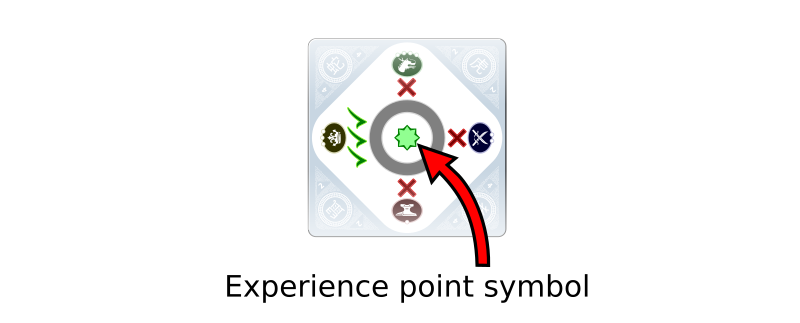
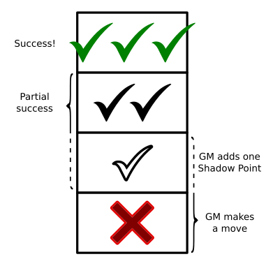
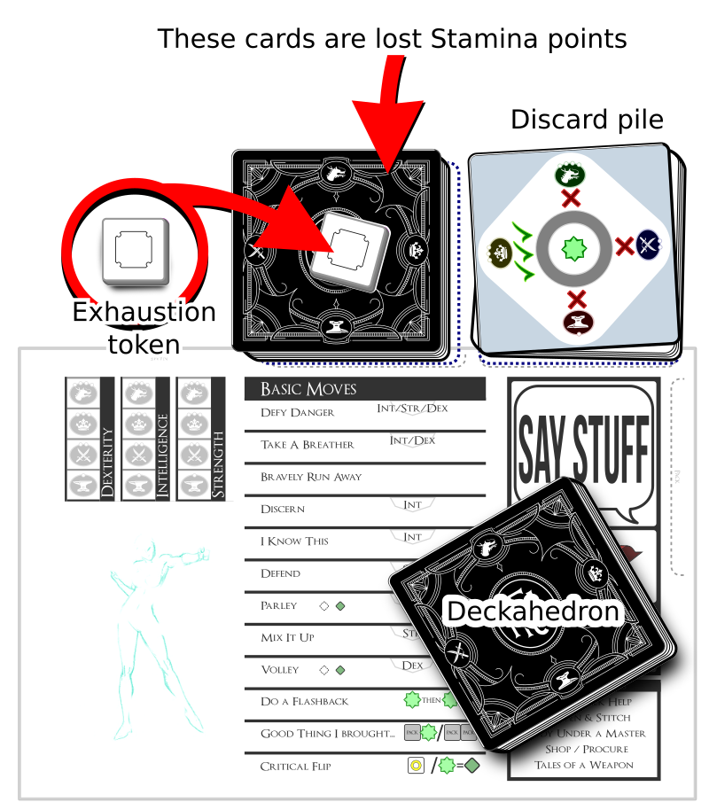
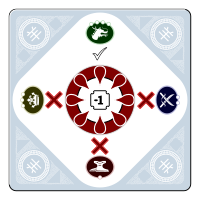
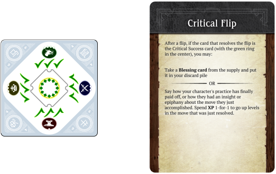
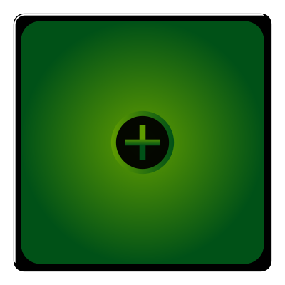
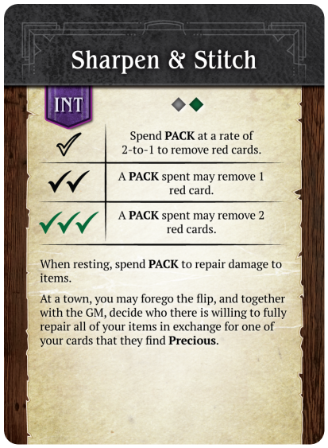

# A Thousand Faces of Adventure: Player's Guide

*playtest version*
*find latest version at https://1kfa.com*
*email sjb@ezide.com*

# Tagline

Like board games? Remember Dungeons & Dragons? Want to try improv?
Welcome to A Thousand Faces of Adventure!

# Welcome to Roleplaying

A Thousand Faces of Adventure (hereafter abbreviated to 1kFA)
is a framework for telling a story. The authors of the story
are you and your friends, sitting around a table.

This story is improvisational, interactive, and collaborative.

The rewards for playing are laughter and excitement while you play, and
warm conversations for years afterwards that start with "Remember that time
we were playing 1kFA and..."

## How to make a great story

Imagine the audience for this story is the inner children of all the players.
What evokes the feelings we had when we were children playing pretend? Can
you remember being 11 years old and watching a spectacular Steven Spielberg
movie?  Or maybe a cheap-but-awesome Sam Raimi movie?

You are going to collaborate with all the other players to make this story,
so when you add your parts, think of what will give your friends around the
table a thrill, put them in suspense, ratchet up their feelings of tension,
or make their jaws drop with awe.

Sometimes inner children get a big kick out of blood and guts.
Your inner child might giggle at the brothel scenes in HBO's Game of
Thrones. If you don't know what topics your friends consider "off-limits",
it is a good idea to ask and tell before you start playing.

The story that emerges from 1kFA is not a precisely crafted
thing. That's ok. It doesn't have to be high art or even a cartoon on Adult
Swim. It gets shaped by each player, and when your turn comes, you
adapt, do your best improvisational
["Yes, and"](https://en.wikipedia.org/wiki/Yes%2C_and...)
, and see where it goes from there.
It might sound like chaos, but with some faith in your friends, you
will delight at how the plot solidifies, and how real the characters
become.

## Specifically, What to do

In a game of 1kFA, one person will take on the role of the
Game Master, or "GM".  The other people will be called simply "Players".

### The GM

The GM's job is to know all the rules, and say stuff.  Occasionally
they will write notes and scribble some quick numerical facts.

The GM's domain is the world.

### The Players

Player, your domain is your character.

{ width=2.5inch }

Most of your time will be spent saying stuff. You are part of a conversation.
Ask questions, use your imagination, chime in when someone inspires you.
Think about your character like a hero of a movie, and try playing as
the writer of the movie, or the director, or immerse yourself like a method
actor standing in the character's boots and seeing with their eyes.

1kFA invites you to:

 * Describe your character and their actions
   * Act out their dialogue
   * Describe *how* they act
      - flourishes and stunts
      - their facial expressions, voice, and body language
   * Tell what they say / hear / see / smell / taste / feel
   * Describe their thoughts & memories
   * Chime in when they interact with or support the other characters
 * Tell parts of the story
   * Tell your character's backstory
   * Contribute ideas and assert facts when the GM asks questions
   * Refer to your **moves** to generate more ideas and see what boundaries you can push

As the conversation unfolds, the rules will chime in as well.  When that
happens you will be called do things beyond just "saying stuff":

 * Flip cards from your Deckahedron
 * Move tokens around
 * Roll dice

This guide will teach you how to do those things.

### Character creation - Fitting the fiction

1kFA is a game about **building** your character up from
a **scrappy adventurer** to a force to be reckoned with.

During character creation, you will get to determine all aspects of
your character's history, social and economic circumstances, and personality.
These are fictional aspects of the character. You will not get to determine
all the *mechanical* aspects of the character though.

Mechanically, characters start out just a little bit more powerful than a
common villager.
They've got an edge over regular folk, (their Stamina points and special moves)
but the game puts them on nearly even footing in a fight.
You can invent any backstory you like, but you may need to answer questions
about how the backstory fits the character's game limitations.

Nothing stops you from creating a hulking, 7 foot tall barbarian, with a rich
history of warring and slaughtering enemies, but at the very beginning of
the game, with a couple unlucky flips, that barbarian may suffer a sound
drubbing at the hands of a farmer with a shovel and his overprotective goat.

This doesn't mean you shouldn't create the barbarian character. You should.
That sounds awesome! But if you do, be prepared to find some narrative
justification (drunkard? battle-worn? magically cursed?) that they're
currently at a "scrappy adventurer" level.

# The Deckahedron

Every player except the GM gets a Deckahedron. Inspect your Deckahedron.
You should have 20 cards.  There are 4 symbols, or "suits", on the fronts and
backs of the cards:

Name      | suit                                    | odds                              | color  | rank
----------|-----------------------------------------|-----------------------------------|--------|-------
Anvil     | { width=0.5inch }     | indicates the weakest odds        | red    | rank 1
Blade     | { width=0.5inch }         | indicates below average odds      | yellow | rank 2
Crown     | { width=0.5inch } | indicates above average odds      | green  | rank 3
Dragon    | { width=0.5inch }         | indicates the best odds           | blue   | rank 4

Shuffle your Deckahedron and place it face-down in front of you.

Whenever your character attempts something risky, where the outcome is
not certain, the GM calls for you to use your Deckahedron and "flip".

In conversation with GM and the rest of the table, you'll decide what
move (or moves) your character is triggering and which of your
character's attributes -- Str, Dex, or Int -- will be used to resolve
the flip.

    GM Note: The attributes used to resolve a move are listed at the top
    of each card.  Sometimes a card gives the option of several
    attributes, like "Flip Str / Dex".  You may need to ask the player for more
    detail about what they are attempting before calling for a flip.

{ width=2.5inch }

Look at the attribute on your character sheet -- what suit is it, Anvil,
Blade, Crown, or Dragon?
Take the top card and flip it face up.

{ width=2.5inch }

The top of the flipped card shows ✗ or ✔s.
These tell you the result of the move.
When you flip, keep in mind that the GM may need to read the result. Being
consistent with how you orient the card will help simplify the GM's
bookkeeping and keep up the pace of the game.

{ width=2.5inch }

Finally, find the move card named by the GM and read its instructions.
It tells you how the GM should interpret the ✗s and ✔s.

Afterward, any card used during a flip goes face-up in a *discard pile*.
Later, you will start another pile of cards called an *Exhaustion pile*.
Keep them separate.

Note: some move cards give you or the GM a choice between several options.
If one of the options is impossible (fictionally or mechanically), it may
not be chosen. Choose one of the other options instead.

## For example,

You're playing a character named Kresk.  You say:

> Kresk sees the pit of spikes in front of him, but isn't scared.
> He just takes a running start and mightily leaps over the pit,
> landing safely on the other side.

The GM might say to you:

> Ok, sounds good, but let's see if Kresk's legs are strong enough.
> Please flip Defy Danger with your Strength.

Look over at the character sheet and see that Kresk has rank 3
(Crown) Str. Flip over the top card of your Deckahedron and
look for that Crown suit.

Let's say you get ✔✔. The GM uses the instructions on the
Defy Danger card ("You do it, but there's a new complication") to
improvise what happens next:

> You leap through the air, landing with a thud on the other
> side of the pit, kicking up a cloud of dust on this forgotten
> jungle trail. Rising to your feet, you notice that more than
> dust has been stirred. The sounds of movement and a threatening
> rattle alerts you to something approaching from inside the pit.
> What do you do?

## Other ways to flip: Advantage / Disadvantage

Some flips are a little more complicated. Some moves in 1kFA
instruct you to "take +1 advantage" or "flip with advantage".
Sometimes you are given the opposite
instruction "flip with disadvantage" or "your foe gets advantage".

### Advantage

With an advantage, flip over your top card as usual, and then
flip over the next card as well.
Compare the results (the number of ✗s or ✔s next to the relevant suit)
and *resolve the flip* with the card that has the **best** result.

If it's a tie, you may choose whichever card to be the card that *resolves
the flip*.

All cards that got flipped go face-up in your *discard pile*.

#### Complete Flip Rule

You must flip over all the cards you were instructed to, even if the first
card shows ✔✔✔.

### Disadvantage

With a disadvantage, do the same thing, but use the **worst** result.

Acting against a foe that has advantage is mechanically identical to your
character having disadvantage.

### Multiple Advantages / Disadvantages

Advantage or disadvantage can stack. Flips can accumulate up to 2
advantage or 2 disadvantage.
This means you flip **3 cards in total** and take the **best**
or **worst**, respectively.

No flip may use more than 3 cards in total, so adding advantage beyond
2 is just ignored.

It is possible a situation might arise where you are instructed to both
"flip with advantage" and "flip with disadvantage".
If this happens, simply add up all the advantages, and then subtract all
the disadvantages to arrive at a "net advantage" or "net disadvantage".
The maximum is still two extra cards, so if the sum is -3, you only
flip with two disadvantage cards.

## Other flip complications: XP cards

{ width=2.5inch }

Resolving flips is how players acquire experience points (XP) in
1kFA. XP are a player's most important mechanical currency
in the game.

Some Deckahedron cards show an experience point symbol in the middle.
These are XP cards.
After a flip is *resolved* by an XP card, take one XP from the supply.

You may only do this when the card *resolves* a flip. (ie, when flipping
multiple cards, only if the *XP card* was the one from which
the ✗ or ✔ symbols were used to interpret the result of the move)

XP are a currency you spend to activate "meta" parts of the
game. See below for moves that let you "break" or "bend" rules, or partially
take control of the narrative.

## Other flip complications: Blessing cards

{ width=2.5inch }

Some cards will instruct you to take Blessing cards. When instructed
to do so, draw one Blessing card at random from the supply, and place
it in your discard pile.

Blessing cards improve your Deckahedron by giving you better chances to
succeed at moves.

Whenever a move is *resolved* by a Blessing card, return the Blessing card
to the supply rather than keeping it in your discard pile.

Note: some moves instruct you to match Chinese Zodiac symbols on the corners
of cards. The corners of Blessing cards have a "dragon" symbol, which is *wild*.
The "dragon" symbol matches all other symbols except for the "goat" symbol
on the wound cards.

## Other flip complications: Wound cards

Sometimes you flip over a wound card and must lose a Stamina point. See the
[Combat chapter](#combat).

## Other flip complications: Teamwork Flip

Before a flip is executed, if other players have characters in the same
scene as the spotlighted character, and there is nothing in the fiction
preventing it, those other players may choose to have their characters
*aid* the spotlighted character. They just chime in before the flip and
say how their character helps out.

Another time the Teamwork Flip is triggered is when the characters are
all bound together in success or failure. (eg, Defying Danger in a canoe
travelling over whitewater) In that case, the GM asks the players "who
is taking the lead?". That player is the spotlighted player, and the other
players are supporting.

The spotlighted player flips as they normally would, the supporting players
say how they are helping and flip one Anvil.

The players choose the best result to resolve the flip.

<!--
Only the spotlighted player can possibly receive experience points from this
flip, and only with their own card. If the card that resolves the flip
wasn't the spotlighted player's, nobody receives a experience point.
-->

Only the card that resolved the flip can generate XP, and only
for the player who played it.

If there are any negative consequences (damage, danger, etc) from the
result, all the participating characters must suffer them.

Supporting players may not Do a Flashback on Teamwork Flips.

## Reshuffling

At any time before a flip, or after a flip is resolved, you may take your
*discard pile* and shuffle it back into your Deckahedron.

Whenever your Deckahedron is down to 5 or fewer cards, you **must** take
your *discard pile* and shuffle it back into your Deckahedron.

## Interpreting the result of a flip

When a player's character performs a move, the player executes a flip,
and the GM leads the table interpreting the narrative result, based on the
text of the move card.

{ width=2.5inch }

Usually ✔✔✔ means an unfettered success, and ✔✔ means success,
but with complication.

When the result is a single ✅︎, it sometimes means the same as a ✔✔,
but often it is slightly worse.

Any time a flip results in a single ✅︎ the GM should add a point to
the *Challenge Bank*  -- even when the move card says it has the same narrative
effect as a ✔✔.

When the result is ✗, it is the GM's turn to make a move. The GM narrates
the consequences of the move the player just attempted and has license to
take the narrative where they like.

See the GM Guide for explanations of the *Challenge Bank* and for a list
of moves the GM is allowed to make.

### Exceptions on ✅︎ and ✗ flips

Sometimes a card does not say how a ✅︎ should be interpreted. In that case,
the GM gets to make a move, just like ✗.

Rarely, a card will have instructions for how to interpret a ✗ result.
These instructions should be executed, but might only be *part* of the
GM's move -- the GM gets to decide if they have more to add.

When the move card has the tag *IMMEDIATE*, the GM does not get to make a
move on a ✗. Instead, the GM just adds 2 points to the *Challenge Bank*.

## Cards tagged IMMEDIATE

Some of your move cards have the tag *IMMEDIATE*. This indicates they can
be used in conjunction with another move during your character's moment in
the spotlight. When players take turns in the spotlight, if they trigger
moves, it is expected that they trigger **at most one** *IMMEDIATE* move.
Otherwise the pace of the game can slow down, and other players may feel
like they aren't getting a fair share of time in the spotlight.

Examples of cards tagged *IMMEDIATE* include Good Cardio,
Where It Hurts, and Unknown Benefactor

A moment in the spotlight might see your swordsman character triggering
the move Mix It Up, causing damage to a foe, and then you might also trigger
Where It Hurts as you describe the sword delivering a stunning blow,
clanging loud and hard against the foe's helmet.

Or, your professor of alchemy character might trigger Defy Danger as they
jump out of the way of a toppling bookcase. After you flip an ✗, the GM
may start enumerating the damage your character must suffer, to which you
could respond by invoking Unknown Benefactor to cancel the damage.

## Flips only happen when the situation is uncertain or risky

A GM only calls for a flip when the situation is uncertain or risky for
the character. If the outcome is certain, the GM may just narrate what
happens. Or they may ask you some clarifying questions.

1kFA is a conversation between people, so there is variability
in how it plays out. Different GMs will draw their line of certainty at
different places.

Consider a situation where the GM has described your character, Kresk,
waking up after making camp in a forest. Beside Kresk is a squirrel,
nibbling an acorn.

You might respond by saying,

"Kresk wants that acorn! I Mix It Up with the squirrel!"

It would be bizarre, but completely within the rules for the GM to write
up some stats for the squirrel (1 Stamina, 1 attack power), and begin a
melee combat between Kresk and the squirrel, and ask you to flip Str
to resolve the Mix It Up move.

But the GM will more likely interpret your action, as described, as having
a *certain* outcome. Perhaps the GM will respond:

 * "As you raise your fist to smash the squirrel, it darts off into the
   forest, never to be seen again."
 * "How is Kresk going to overcome the squirrel's natural speed and reflexes?"
 * "You smash your fist down and flatten the rodent. Strangely, it didn't
   even flinch. Does this odd behaviour remind Kresk of the rumors he heard
   about this forest being enchanted?"

### Pushing buttons or staying in character

The GM doesn't always have to invoke a move and call for a flip.  But in
this example, the player literally names a move ("I Mix It Up...").
That's a strong signal to the GM, and the GM is likely to follow strong
signals.

If you enjoy playing in a style where things flow like a conversation or
a story, from question to answer, from description to dialogue and back
around again, rather than pushing a limited set of buttons laid out in
front of you, try playing without *naming* the moves. Just describe what your
character does in a natural way.

"Kresk wants that acorn! I slam my fist down on the squirrel!"

### Fictional position *matters*

Because uncertainty is a key requirement before a flip is called for,
the fiction that you and your friends establish in 1kFA *matters*.

If a character threatens a towering Mountain Giant with a punch in the shin,
the GM will not call for a Parley flip. A wound to the arm or hand might be
described in such a way that would clearly make using a bow for Volley or
Called Shot impossible. Or successful application of an Amulet of Amiability
might mean that Pick Pockets can be skipped - the affected NPC might just offer
to share their precious items.

# Combat - Stamina/Harm/Wounds

Here are rules to determine when your character is able to endure
exertion and injury to keep moving forward or when they're completely
spent and collapsed in a heap.

When a character is in a fight, they are running, dodging, striking, and
being struck and assailed by their foe.  All of this stuff is scary and
exhausting. So a character gets weaker the longer they're in this
exchange, even if they're able to dodge every blow.

This weakening is represented by cards from your Deckahedron being lost
into your *Exhaustion pile*.

Have you ever watched a boxing match or a mixed martial arts match? During
the later rounds, the athletes are worn down, they don't dance around the
ring with as much vigor, and drop their guard more frequently. The contest
is not always decided with a knockout punch, it often comes down to who can
better endure the exertion.

**Every PC has 10 Stamina points.** When a PC loses all 10, they are
incapacitated. After that, their fate is up to the GM.

## Phases

When your character gets attacked or falls victim to some other danger,
you have choices about exactly how they are affected. They may dodge,
and just lose Stamina, they may stand stubbornly against a blow,
perhaps absorbing it with their armour, or they may be wounded by it.

The **first phase** is rolling dice to arrive at a number. This number
is called the *attack power*.

The **second phase** is deciding whether to lose Stamina or take a Wound.

The **third phase** is optional: absorbing some points using any relevant
move cards and item cards.

The **fourth phase** is losing Stamina points and receiving Exhaustion
and Wound tokens.

Finally, the **fifth phase**: you interpret those results into the
narrative.  Did your character dive into the dirt?  Did they take a punch
to the jaw and respond with a bloodied grin?  Did the spear bounce right
off their steel breastplate?

    GM Note: The act of taking a risk, deciding how to get hurt, and then
    later, deciding when and how to heal, with each stage having its
    sacrifices and benefits, is a miniature echo of the overall structure of
    the Hero's Journey campaign. Starting in comfort, choosing to cross a
    threshold, deciding which fork to take in a road of trials,
    then returning.

## First Phase

When your character suffers the consequences of violence, you roll dice or
read instructions from a move card to get a number. This number is called
the *attack power*.

## Second Phase

After the *attack power* is calculated, you can choose to take a Wound
rather than losing that many Stamina points.

You can always choose to absorb the whole amount of *attack power* by taking
a single Wound.

Let's say your character was attacked with a sword and the dice were rolled
and summed up to 7. You can either lose 7 Stamina points, or choose to take
a Wound instead.

Let's further say your character had lost 3 Stamina points earlier in the
battle. With only 7 Stamina points left, it's a wise time to take a Wound.

## Third Phase

In the third phase, you may absorb Stamina and Wounds with your armour,
shield, or with moves like Good Cardio, Mystic Breathwork, Like A Second
Skin, and Sangfroid.

## Fourth Phase: Stamina / Exhaustion

Characters have 10 Stamina points. To win at combat, a character's
foes must be subdued or pacified before 10 cards are lost from the
Deckahedron.

When you are instructed to lose a Stamina point:

 1. Take a card off the top of your Deckahedron, do not look at the face side.
 2. Put that card face-down on your *Exhaustion pile*
 3. Place an Exhaustion token on your *Exhaustion pile*

{ width=2.5inch }

{ width=2.5inch }

(So, if you were instructed to lose 3 Stamina points, you add 3 cards
from the top of your Deckahedron onto your Exhaustion pile, then you
put 3 Exhaustion tokens on top of it as well.)

If your Deckahedron does not contain enough cards, the player **must**
reshuffle their *discard pile* into the Deckahedron and continue.

Note: Players *may* choose to reshuffle their *discard pile* back into the
Deckahedron *before* moving cards onto their *Exhaustion pile*.

Once the *Exhaustion pile* grows to 10 cards, the character is
*incapacitated* and can take no further actions.
It is up to the GM to decide what this incapacitation means - whether
the character is dead, unconscious, or just unable to stand or move.

## Wounds

Getting wounded sucks, and when wounded, all intelligent creatures seek
to cure their condition as a very high priority.

### Fourth Phase: Receiving Wounds

When you are instructed to take a Wound token:

 * **If you already have 2 wounds**:
   - the character is incapacitated
 * **Otherwise**:
   1. the GM describes how the character was wounded
   2. Lose a Deckahedron card to your *Exhaustion pile* as you would when
      you lose a Stamina point.
   3. Place a *Wound token* on your *Exhaustion pile*
   4. Randomly draw a *wound card* from the supply and place it in your
      *discard pile*. It will now start cycling between your Deckahedron
      and your *discard pile*.

{ width=2.5inch }

### A Wound Card

{ width=1.1inch }

Having a *wound card* in your Deckahedron causes some nasty effects.

Whenever you **flip** and reveal a wound card, follow these rules:

 * Say or act out the guttural noise emitted by your character
 * You must immediately stop flipping (eg, if you were
   instructed you to "flip 3", you stop short once you hit
   the wound card - resolve the move with only the card(s) you flipped.
   This overrides the **Complete Flip Rule**)
 * Lose a Stamina point

Wound cards can be used to represent different fictional aspects. They
usually represent literal wounds, but may also be used for the effects of
disease, poison, or other effects inflicted by monsters or the environment.

Note: some moves instruct you to match Chinese Zodiac symbols on the corners
of cards. Wound cards' corners have the "goat" symbol which does not match
any symbol.

# Encumbrance Penalties

Your character has a movement speed, a certain lightness-of-foot,
they carry a certain amount of equipment and items,
and perhaps even a certain amount of wealth or treasure.

There are some moves that are affected by how much *stuff*
a character carries. These moves have the tag "UNENCUMBERED", and declare
an encumbrance penalty in their descriptions.

At any time that it makes sense in the fiction, a character can drop items
and equipment.

Daily-use amounts of money and food are not tracked. It is assumed
your character will always be able to scrounge a meal somehow.
Unless it is relevant to the drama of the fictional situation or
inspired by the Touchstone List, small monetary transactions
may be abridged or assumed.

It is also not necessary to exactly measure movement speed or the sizes
of all the gear carried or to track the body part to which the gear
is strapped.

# Notes on Moves

## Good Thing I Brought...

{ width=2.5inch }

Adventurers are always finding themselves in tricky situations. Luckily,
they come prepared with adventuring gear. They have been known to carry
50 feet of rope, smelling salts, books of racy poems, sometimes even a
3-day-old pork chop to distract hounds or hungry goblins.

It's a fact. You know this and 1kFA knows this, so you won't be asked
to keep fine-grained notes of every candle and spare button in your
character's inventory.

Reasonable daily-use items are presumed to be in your character's pack. If
you're unsure, remember 1kFA is a conversation, so just ask the table.

But sometimes you will be in a situation where having that 50 feet of rope
or an old pork chop would really *solve a problem* for your character.

When your character reaches into their pack and produces the item that
solves their current problem or helps them overcome a challenge, just say
what it is and execute the "Good Thing I Brought..." move.

The Pack cards represent the adventuring gear a character has brought along.
But you do not need to declare exactly what that gear is until you're in
a situation where you need something specific.

If the "Good Thing I Brought..." move is executed and the newly "declared"
equipment is something that can be returned to the backpack after
use, write its name down on a blank card and exchange that card for the
"anonymous" Pack card(s) that were the cost of "Good Thing I Brought...".

If the equipment is something that gets consumed immediately when used,
the 1 or 2 Pack cards just get discarded.

If 2 red cards are spent, and the character ends up with one card returning
to their backpack, use the fiction to justify that. Maybe they didn't have
*exactly* what they needed, so one piece of equipment had to be consumed
to create the necessary tool, in a MacGuyver-esque fashion.

## Do a Flashback

{ width=2.5inch }

Sometimes you plan out something really great, and then you resolve
a flip, and don't get the results you need.

A Flashback serves as sort of a "mulligan" in those situations, but it also
provides a way to develop your character's backstory and personality.

After a player makes a flip, and before the GM describes the consequence of
the flip, the player can declare they're going to `do a flashback`.

The player spends 1 XP. Then they describe how something
that happened in the past particularly prepared their character for
this situation.

Then the original flip is ignored, and a new flip is executed, using the same
advantage or disadvantage as the original flip.

The player may then spend additional XP to "bump up" the result.
Each XP spent increases the result, from ✗ to ✅︎ to ✔✔ to ✔✔✔.

Technically, this flip is *resolved* only after the XP are spent, so if the
new card was an *XP card*, the player should take an XP from the supply only
*after* they finished spending their XP to "bump up" the results.

### Mercy Flashbacks

Players may find themselves in a situation where they forgot to do something
when they had the chance, like use healing magic while they were resting,
or leveling up a move before they left a steading, or getting some key
information from an NPC before that NPC died.

As long as the player and the GM both agree that the player had the necessary
resources when the action was available, the GM may allow the player to
spend those resources and effect that action now, as a "Mercy Flashback".

The player must spend one XP, in addition to whatever cost the action incurs.

Even the most conscientious of us sometimes loses track of small details,
so the cost is kept "cheap" at only one XP. But there must be a cost.
It is necessary to keep the flow of the game going. This is a game of improv
storytelling, and improv means rolling with the punches sometimes.

## Critical Success

{ width=2.5inch }

One of the 20 cards in your Deckahedron is the "Critical Success card". It
has a ✔✔✔ symbol on every edge and a circular green symbol in the middle.

If you *resolve a flip* with the Critical Success card, you can do two things:

 * Say how your character's practice has finally paid off, or how they had
   an insight or epiphany about the move they just accomplished. Spend
   XP 1-for-1 to go up levels in the move that was just resolved.
 * Take a Blessing card from the supply and put it in their discard pile.

## Taking a Breather

{ width=2.5inch }

**Taking a Breather** is a move that a character can take during combat.
This action allows a character to regain up to 4 Stamina points.

The player may use either Intelligence or Dexterity to perform the **Take a
Breather** action.

If they use Intelligence, they say how they execute a tactic or
recognize a favourable position that lets them gather their breath
and their wits.

If they use Dexterity, they say how they maneuver into a safe position
that offers some temporary safety.

Regaining Stamina may be done either by taking cards from the
*Exhaustion pile* and putting them into the *discard pile*,
or by returning Exhaustion tokens to the supply.

When recovering cards from the *Exhaustion pile*, the player may choose any
cards they want, but may not flip them face-up if they are face-down.

When combat or a pursuit ends, and it is appropriate for the narrative
(e.g. when there's a scene transition and the characters reasonably have
a few minutes to catch their breath), the players may **Take a Breather**
using Str as an IMMEDIATE move (ie, no negative narrative consequences
if the result is ✗ or ✅︎).

## Good Cardio

This card makes a character an especially resilient fighter and athlete.

In a combat encounter, a player will usually trigger an aggressive move like
Mix It Up or Volley.  In addition, players often trigger at most one
*IMMEDIATE* move. If they haven't chosen an different *IMMEDIATE* move, they
can always trigger Good Cardio, and regain some of their lost Stamina points.

This is a highly recommended strategy for any character who has lost Stamina.

---

# SESSION 2 RULES

---

# The Session Opener

Every session after the first session, there is a special move to execute
at the very beginning, **The Session Opener**. It is a player's opportunity
to generate an extra XP.

Your GM will lead you through a story recap and pose some questions about
your character.  Then you will be given the opportunity to **Ask for
notes** and **Give notes** to your fellow players.

After this exercise, all participating players will receive an XP.

The details of the Session Opener are described in
[the GM Guide](mod_guide_gm.md).

# Notes on Moves - Healing

Throughout 1kFA, players are asked to decide how their
characters get hurt, how they respond to being hurt, and how they recover
from their injuries.

This is a small-scale echo of the whole story - the Hero's Journey itself.
At the center of the Hero's Journey is a moment of pain that the hero
must fully endure before finding relief - either through their own action or
with the help of their friends. The Hero's Journey is a myth that teaches
us how to take care of ourselves, and so this game holds a puzzle where the
players to learn how to take care of their characters.

## Resting

{ width=2.5inch }

*Resting* is an action that a character may take when they are out of combat,
not travelling, and have several hours to devote to rest (sleeping qualifies).

 * Step 1: Return all *Exhaustion* tokens to the supply
 * Step 2: Count the *Harm* and *Wound* tokens on your *Exhaustion pile*
 * Step 3: Keep that many cards (player choses which ones) in your
   *Exhaustion pile*, put the rest into your *discard pile*
 * Step 4: Return one *Harm* token to the supply
 * Step 5: Say who you blame for your injuries

When resting, magic items that are not being used regain all charges, up
to their maximum capacity. Remove all white-side red cards on your magic
items.

You may gird all your armour, where applicable.
Remove all Harm and Wound tokens from your armour cards and from move cards
that represent armour effectiveness (eg, Like A Second Skin).

Time devoted to *Resting* cannot also be devoted to learning skills,
studying with a teacher, or any other action that takes mental or physical
effort.

The Harm token returned to the supply in Step 4 may come from your
*Exhaustion pile* or from a slot on a move card (eg, Bloody But Unbowed).

It is possible that the object of blame named in step 5 is the character
themself.

## Seek Help

{ width=2.5inch }

*Seeking Help* is an action that a character may take when they are in a
peaceful environment where external resources with healing powers are
available.

Eg, if they are in a primitive camp posessing medicine men or a
contemporary city with doctors and hospitals or a tranquil oasis infused
with healing magic.

That the healing powers are *external* is important. Seek Help is a move
where players explore how their characters have limits and cannot do
everything on their own.

When you spend a day healing:

 * Step 1: Describe your character's healing experience
 * Step 2: Return all *Exhaustion* tokens to the supply
 * Step 3: Return all *Harm* tokens to the supply
 * Step 4: Count the *Wound* tokens on your *Exhaustion pile*
 * Step 5: Keep that many cards (player choses which ones) in your
   *Exhaustion pile*, put the rest into your *discard pile*
 * Step 6: Return one *Wound* token and one *wound card* to the supply
 * Step 7: Say who you are closer to forgiving

As with *Resting*, time spent *Seeking Help* cannot also be used in
activities that take effort.

Magic items that are not being used regain all charges, up to
their maximum capacity.  Remove all white-side red cards on your magic items.

You may gird all your armour, where applicable.
Remove all Harm and Wound tokens from your armour cards.

# Notes on Moves - Item-related

## Item Damage

`TODO item damage diagram`

Damage to items is represented as black-side red cards. When an item is
damaged a third time -- when it already has 2 black-side red cards --
it is instead destroyed. The card is returned to the supply.

## Shop / Procure

{ width=2.5inch }

When the Shop / Procure move is used, the scene can be described as an
everyday shopping trip or a theiving and bribery escapade, or anything
else that makes sense in the narrative, so long as the mechanical
outcome would be certain.

The GM presents to the player 4 cards of any mix of items: mundane,
magical, a special commodity established in the narrative, or even
something purely decorative. It is ok for the GM and player to discuss
the items beforehand to any level of detail, and it is also ok for the
player to outright say what they want to go shopping for.

The GM should be honest with the narrative, stay true to their goals and
try to provide the kind of fun the player has signaled they want to have.

The GM shall not hand a player a card with mechanical requirements the
player's character doesn't meet.

### Mundane Items: Armor, weapons, etc

There are mundane items in 1kFA, as well as magical ones.
1kFA has rules for weapons, shields, and armour. But characters
may have other items as well. Those other items may just be decorative
or they may have narrative value (carrying around a small barrel of brandy
may earn you a welcome from the thirsty dwarves you meet).

<!--
You can even create rules of your own for certain classes of item.
See the [Extending 1kFA](#extending) chapter for hints on how
to do that.
-->

#### Weapons

Weapons cards describe what the character has armed themself with. These
cards might describe "weaponry" rather than a single item, as the Many
Knives card demonstrates.

Weapons have a "power level": d4, d6, or d10. This determines what die to
roll when you roll attack power. Higher power weapons should not be given
out lightly. Generally players should seek weapon power increases from the
Craft a Weapon and _ Mastery moves.

The GM should decide if the weaponry incurs any additional costs when
calculating encumbrance penalties. Is the item particularly heavy or large?

Here are the weapons available to characters during character creation:

Name             | S/W/P token requirement | notes
-----------------|-------------------------|--------------
_ Sword          | 1                       |
Many Knives      | 1                       | At close range, can be thrown
_ Bow            | 1                       | Long range

#### Armour

When an armour-clad character would normally take Harm or a Wound, the
player may put the Harm or Would token into an appropriate empty slot on
their Armour card.

The armour available to characters during character creation is the weakest
kind. This kind of armour has 1 slot that can absorb Harm or a Wound.

When a character goes shopping, goes a-thieving, discovers treasure, or loots
a battlefield, the GM may offer new, more useful armour with more slots drawn
on it.

`TODO illustration of Harm / Wound slots`

The GM should draw up to 3 slots on the card. A slot shall be designated to
receive either:

 * 1 Harm token
 * or 1 Harm *or* Wound token

The GM should decide if the armour incurs any additional costs when
calculating encumbrance penalties.
Better armour tends to be heavier and impedes graceful movement.
Any increased encumberance penalty should be written on the card.

The GM and player should agree on a descriptive name for the armour like
"Padded" or "Chainmail" or "Full plate" and write that at the top of a card.
The GM may use the name to create implications in the narrative -- it's hard
to sneak or swim in full plate armour.

If a GM writes narrative circumstances that cause a disadvantage on the
armour card when it is created, no points need to be spent from *Challenge Bank*
to create the disadvantage later.

Here are some example armours:

Suggested Name   | token requirement | slots
-----------------|-------------------|----------------------
Leather Armour   | 1                 | 1 Harm/Wound
Padded Armour    | 2                 | 2 Harm, 1 Harm/Wound
Full Plate       | 3                 | 3 Harm/Wound

#### Shields

Shields are a way to avoid Harm and Wound tokens, but they test your
Dex in order to succeed. See the Bracers card for an example.

To make a Shield card, first the GM chooses the ✔✔✔, ✔✔, and ✅︎ effects by
choosing 3 sequential effects from this list:

 * Avoid the *x*
 * Avoid the *x*, but choose to lose 1 Stamina or this item takes 1 damage
 * Avoid the *x*, lose 1 Stamina
 * Avoid the *x*, lose 1 Stamina and this item takes 1 damage

The *x* can be either:

 * Harm
 * Harm or Wound

Then the GM and player come up with a name for this kind of shield together,
using the same rules as the Armour name-creation above.

The fictional description of the "shield" has mechanical consequences. For
example, the edge of steel shield could reasonably be used to attack a foe,
so Mix It Up would do 1d4 attack power. But a character with only leather
bracers their wrists would be "unarmed", doing just 1d2 attack power.

Blocking damage with a shield should be considered an *IMMEDIATE* move, and
the GM should try to keep to the guideline of not allowing players to make
more than one move and one *IMMEDIATE* move per turn in the spotlight.

# Notes on Moves - Magic-related

<!-- TODO remove trademarked references -->
Magic is an element that pervades stories of fantasy. It can be obscure
and stemming from nature like in Lord of the Rings, it can be elemental and
allegorical like in The Wheel of Time, and it can be linguistic and
self-aware like in The Invisibles.

To avoid presuming too much about the narrative, the rules do not dictate
the nature of magic or the "how" of magic. That's for you to decide during
play.
The rules provide a mechanical foundation and some optional narrative paths.
You are invited to take this well-tested framework, play with it, and expand
into it.

Is magic woven from subtle threads that pervade the universe? Is it based
on words of power? Is it high technology hidden in the planet's crust
by alien benefactors? Is it copied exactly from a concept in your Touchstone
List? You decide.

The rules give you a way to have scrappy adventurers begin with magic items.
These artifacts have 3 charges, and are rechargeable during Rest.
Your character can eventually build themselves up in power to a point where
they can cast magic spells without needing the items.

The rules also give names for two sources of magical power, "The Living
Light" and "The Blood-Bound". It's up to you to give these names narrative
meaning, if you want.

One thing to keep in mind is that characters may attempt any move that
resolves with Str / Dex / Int.
(See [Move Levels](#move_levels)
So even if moves like Use a Magic Item or Fundamental Magic were not chosen
at character creation or gained via Study Under a Master, any character may
attempt them.

That said, using magic invokes some of the more complicated rules of
1kFA. Players are challenged with managing and balancing
charges, capacity, stamina, requirements and narrative effect. This kind
of play is ideal for players excited by complexity and the potential
of explorable branches.

#### Charges and Capacity

By default magic items have capacity for 3 charges. When a charge is used
from a magic item, place a red card on it, white-side-up.

Sometimes charges are lost *permanently*. This means it loses a charge and
its capacity for charges decreases by 1. When this happens, place a red
card on the item, black-side-up.

The Obsessive Contemplation move can be used to gain capacity. When a magic
item gains capacity, remove one black-side red card from it, or, if there
aren't any black-side red cards on it, write down its new capacity on the
card.

Magic items cannot be damaged.

#### The ONGOING tag

When you Use a Magic Item, you are "flowing magical energy" into it. Then
the magical effects happen.

Some magic effects happen immediately.

Some magic effects persist even after you have finished flowing magical
energy into the item. (eg, `_` of Light, Reaching `_`)

Some magical effects persist only if you continue to flow magical energy
into the item. These items are identified by the ONGOING tag. While you
are flowing energy into such an item, you may not regain Stamina points
while using the Rest or Seek Help moves.

## Use a Magic Item

{ width=2.5inch }

When a character holds a magic item and flows energy into it, the player
flips Int, and on any result other than ✗, the item activates and the
effects described on the magic item card happen.

Using a magic item causes it to lose a charge. This loss can be avoided
with moves like Entreat the Blood-Bound and Channel the Living Light.

Following that, results of ✅︎ and ✔✔ cause a further cost to be incurred,
as chosen from the list by the GM or the player, respectively.

**Note:** if the magic item being used is a magical weapon created via
Tool Twisting, another choice is available: "the weapon is damaged"

An item has 3 charges by default, and is considered "depleted" when they
are all used. The term used for this maximum number of charges is
"capacity" or "charge capacity".

When a magic item loses a charge, take a red card and place it white-side-up
on top of the magic item card.

When a magic item **permanently loses** a charge, take a red card and
place it **black-side-up** on top of the magic item card.

If the magic item has the *ONGOING* tag, magical energy continues
to flow into the item. This has mechanical interactions with the Rest
and Sever-Pulse Shield moves and might also have narrative consequences.

When a player chooses this card during character creation or Study Under a
Master, they also recieve 1 magic item of their choice.

## Entreat the Blood-Bound

{ width=2.5inch }

If it has not yet been established, when a player first uses this move, it's
a great time for the GM to ask them a question: "Who or what is the
Blood-Bound?"

    GM Note: this is a great way to stretch your improv muscles. Say "Yes,
    and..." no matter if they identify the Blood-Bound as tiny, parasitic
    insects or as monstrous, extradimensional dark gods.

When a player chooses this card during character creation or Study Under a
Master, they also recieve the item Blade of Echoes.

## Channel the Living Light

{ width=2.5inch }

If it has not yet been established, when a player first uses this move, it's
a great time for the GM to ask them: "Who or what is the Living Light?"

When a player chooses this card during character creation or Study Under a
Master, they also recieve the item Sigil of the Living Light.

# Move Levels

Some Move cards have icons on them that indicate "levels". These levels
represent how good your character is at that skill. For example, the move
Pick Pockets has 5 icons.

{ width=2.5inch }

These are the "move levels" for Pick Pockets.
From left to right, these icons are called:

 * { width=0.5inch } wild or "2 red"
 * { width=0.5inch } novice or "1 red"
 * { width=0.5inch } "base level"
 * { width=0.5inch } expert or "1 green"
 * { width=0.5inch } master or "2 green"

If you chose Pick Pockets during character creation, you would receive
the card and your character would be "studied" in the skill.
The word "STUDY" is over "base level", so that's the level you would
start at.

Note: some moves, like Void Transfusion, don't start you off at the base level.

## Increased Move Levels

Later, you can go up a level in Pick Pockets. Either by using the Study
Under a Master move, or when you resolve a Pick Pockets flip and happen
to get a *Critical Success card*
See [Critical Success](#critical-success)

{ width=2.5inch }

Take a green card, and put it on top of the move card. Put the green
card black-side-up.

`TODO: diagram`

With Pick Pockets leveled up, any time you perform that move in the future,
you will add an advantage card when you flip.

Because the Pick Pockets card shows the "2 green" icon, you can repeat this
process again later, which would let you add 2 advantage cards when you flip.

## Decreased Move Levels

But what about the 2 "red" levels?

In 1kFA, any character can attempt any move that is performed
by flipping Str, Dex, or Int -- even if the player doesn't have that move
card!

For any such moves, all characters start at the lowest level shown on the
card.  So every character is "wild" or "novice" at every skill that is
tested by flipping Int, Str, or Dex.

Every character, at any time, can attempt to hit two opponents in combat
(via Goreography). Every character can attempt to cast a spell (via
Fundamental Magic). But, their odds are very low.

You can attempt moves even if you don't meet the requirements shown.

Just as the "expert" and "master" levels cause the flip to be done with
advantage, the "wild" and "novice" levels cause the flip to be done with
disadvantage.

 * { width=0.5inch } flip with 2 levels of disadvantage
 * { width=0.5inch } flip with 1 level of disadvantage

If you perform a "wild" level move, and you resolve that flip with a
*Critical Success card*, you can spend 1 XP to graduate to "novice" level.

{ width=2.5inch }

If you choose to do so, take the move card and a red card. Place the red card
on top of the move card, black-side-up.

# Notes on Moves

### Study Under a Master

{ width=2.5inch }

This is the move by which your character becomes a powerful force in
the world.

When your character is in a steading (a villiage, city, etc. -- any safe
place where resources and commerce present themselves), you can spend 2 XP
to either:

 * Increase the level of a move you already have
   (See [Move Levels](#move_levels)
 * Take a new move card from the supply

If you want to take a move card that another player already has or one that
was scribbled over in a previous campaign, or just has been ruined by spilled
beer, you can copy the text onto a new card.

### Bravely Run Away

{ width=2.5inch }

When players find themselves on the losing side of a battle, or want to
avoid a daunting threat, they may choose to run away. If their characters
are positioned in a way that their escape is possible, according to the
established fiction, the GM will allow them to escape, but there is a cost.
The players temporarily lose narrative control and the GM gets to say
where the players' characters end up.

There may also be a Stamina cost (or Stamina gain) depending on how weighed
down the characters were by their equipment.

The GM can resolve this move by:

 * putting the characters somewhere completely safe
 * putting the characters in a place where some (new or old) danger exists,
   but is, for the moment, not directly threatening the characters
 * spending a point from the *Challenge Bank* and starting the Pursuit Mini-game
 * spending a point from the *Challenge Bank* and putting the characters in
   a place where they must directly confront or defy a new danger

---

# SESSION 3 RULES

---

### Sharpen and Stitch

{ width=2.5inch }

Non-magical items can be damaged in 1kFA. Usually this happens
narratively as the result of a GM move, but it can also be caused by player
moves, eg. Armour Mastery.

The "1-2-bust" mechanism is used to represent damage.

The first two times an item is damaged, place a red card on the Item card,
black-side-up.

The third time an item is damaged, it is destroyed. Return it and the red
cards to the supply.

## More Power

### Tales of a Weapon

{ width=2.5inch }

The GM should decide whether the weapon will incur any extra cost when
calculating an encumbrance penalty.
Is the item particularly heavy or large? The GM should weigh that
cost against the weapon's other features.

### Weapon Mastery

{ width=2.5inch }

The weapon mastery card allows a player to, during downtime, create a reward
that they themself will receive during a future combat encounter.

For the sake of balance, the GM may choose to write a downside or limitation
on the weapon mastery card. A specific category like "rapiers" might not incur
any balancing, "swords" might incur a light amount of balancing, and something
very vague like "blades" might incur a high amount of balancing.

This process should be discussed by the table to arrive at a fair balance.

Here are some examples:

 * "Sword" Mastery: the sword must have been forged by a competent smith
 * "Blades" Mastery: only applies to one-on-one combat
 * "Staff" Mastery: the GM can say staff breaks if max attack power is rolled
 * "Blunt weapon" Mastery: only effective in open spaces
 * "Fist" Mastery: "close range" position must first be fictionally established

### Magic Items

 * _ of Unerring Dispatch
 * _ of Vitality

----

# Advanced and Optional Rules

----

# Combat in the 9-hour and 30-hour Campaigns

If you are playing the One-Shot Campaign, you can skip this section. The
Harm token rules are for the longer campaign formats.

In the 3-hour campaign, the second phase is a choice between just 2 things:
losing Stamina or taking a Wound. In longer campaigns, the choice is
more granular.

## Second Phase

During the second phase of resolving a combat action, players have the choice
between losing Stamina or taking a Wound as explained before, and also
a third choice: to turn any 3 *attack power* into Harm tokens instead.

For example, you may split the attack power of 7 into:

 * 4 Stamina points
 * 1 Harm token

You may even do that twice, splitting the attack power of 7 into:

 * 1 Stamina point
 * 2 Harm tokens

## Fourth Phase

Think of that boxing match again.  If Stamina represents dancing, ducking,
and dodging, then Harm represents landing a blow.
These rules are also for representing mental strain that is so significant
that the negative effects last for a while.

*Attack power* turns into Harm tokens at *exactly* a rate of 3-to-1. You
cannot choose a Harm token when facing an attack power of 2.

When you are instructed to take a Harm token:

 * **If you already have 2 Harm tokens on your Exhaustion pile**:
   - Take a *Wound* instead
 * **Otherwise**:
   1. Lose a Deckahedron card to your *Exhaustion pile* as you would when
      you lose a Stamina point.
   2. Place a *Harm token* on your *Exhaustion pile*

> Note, you will see this "1-2-bust" pattern repeated in many
> of 1kFA's rules

{ width=2.5inch }

## Stamina - Heroic Mode

The Stamina rules described above are known as "Lucky Mode". Those rules
allow the players to lean on luck at the beginning of the game, because
the "worse cards" of the Deckahedron might end up in the *Exhaustion pile*,
shifting the odds to increase a player's chances to succeed at moves.

During the 9-hour and 30-hour campaigns, players will have the choice to
switch to "Heroic Mode", sacrificing their potential to get lucky for more
knowledge and control over their outcomes.

In "Heroic Mode" characters still have 10 Stamina points. But now, these
points are represented only by cards in your Deckahedron with a Stamina symbol

{ width=2.5inch }

When you are instructed to lose a Stamina point, you may absorb it
using any relevant move cards and item cards, otherwise:

 1. Reveal cards in your Deckahedron until you find a card with a Stamina symbol
 2. Put that card aside, *face-up* in your *Exhaustion pile*
 3. Place an Exhaustion token on your *Exhaustion pile*
 4. The other revealed cards go into your *discard pile*

{ width=2.5inch }

(So, if you were instructed to lose 3 Stamina points, you add 3 cards
with Stamina symbols onto your Exhaustion pile)

If searching through their Deckahedron does not yield a card with a Stamina
symbol, the player **must** reshuffle their *discard pile* into the
Deckahedron and continue searching.

Note: Players *may* choose to reshuffle their *discard pile* back into the
Deckahedron *before* searching for Stamina points.

If there are no Stamina points in the Deckahedron *or* the *discard pile*,
then all 10 must be in the *Exhaustion pile*. In this case, the character
is *incapacitated* and can take no further actions.

    GM Note: The switch to Heroic Mode is a way for the players to make
    a choice that echoes Chapter 5 in the Hero's Journey. They themselves
    become heroes.
    By transcending randomness and meet the challenges of resposibility,
    capability, and commitment, the players will have new power to get
    the outcomes they desire.

When playing in Heroic Mode, you may look through the cards of your
*exhaustion pile* at any time.

# The Pursuit Mini-game

When dangerous foes are chasing the PCs, use these rules
to determine what happens.

When a player first declares that they are going to Bravely Run Away

 * Starting player declares
 * Other players declare whether their character joins
 * One character - the one with the most Items + PACK is declared
   the "rabbit"
 * Best 3 of 5 rounds
 * Rabbit flips solo
   * Add the rabbit's Str + Dex, then subtract their encumberance penalty (the
     count of all their Item and Pack cards)
   * Find their flip rank on the table below
 * For the rounds 2 through 5, the rabbit flips, but can be helped by any of
   the other joining PCs. The best result between the rabbit's flip and
   the helper's resolves the round. Each one of the rounds can be helped
   by Int, Str, or Dex, without repeating. The help must be justified by
   the attribute.
   * Int
     * Hiding
     * Using words to influence a crowd
   * Str
     * Climbing a wall
     * Making a great leap
   * Dex
     * Sliding / tumbling down an embankment
     * Dancing across a precarious rooftop
     * Jumping from the second floor onto a waiting horse
 * The last flip must be made by the rabbit alone.
 * If the pursuers ever win 2 flips in a row, they can make a move in the middle
   of the pursuit if appropriate, like firing a volley of arrows or sounding
   some kind of alarm

| (Str + Dex) - Enc  | < 0                    |   0                      |   1    |   2    |   3    |   4     |   5         |
| ------------------ | ---------------------- | ------------------------ | ------ | ------ | ------ | ------- | ----------- |
| Flip:              | Anvils 2x disadvantage | Anvils with disadvantage | Anvils | Blades | Crowns | Dragons | Dragons with advantage |

# 30-hour Campaigns: Level cards and green rings

If you are playing the One-Shot Campaign or 9-hour Campaign, you can skip
this section.

## Green rings / REQUIRES

{ width=2.5inch }

<!-- Summary -->
When you Study Under a Master, the cards available to choose from are limited
by the REQUIRES tag. If you cannot arrange your move cards to form the number
of rings shown in the REQUIRES tag, you cannot choose that move.
<!-- /Summary -->

Some moves have requirements. These are illustrated as green rings,
sometimes with a letter inside -- *R*, *F*, or *W*. Requirements are
sometimes separated by a slash, **/**, which means "or".

For example, using the Study Under a Master move can gain you the card
Fundamental Magic only if you have two green rings or one *W* ring.

What, then, are these rings?

Take a look through the move cards and see that there are partial rings
printed on them - either in the corners or on the sides.

When you can arrange your own move cards together in such a way that a
ring is completed, you "have" a ring. If your cards can arrange to
show 2 rings, then you "have" 2 rings.

{ width=2.5inch }

If your card arrangement had the cards Pick Pockets and Not On My Turf
next to each other, you could complete an *R* ring. If you had
the Scent of Blood card instead of the Not On My Turf card, you could
arrange it next to Pick Pockets to complete a ring, but it would not
be an *R* ring or an *F* ring, it would be considered a solid green ring.

You do not have to keep your cards in this arrangement while you play.

## Level cards

At the beginning of each session, players should arrange their move cards
to count how many green rings they have. Usually, players will not have
any green rings at the beginning of session 2 -- session 3 tends to be
the first session where this rule matters.

{ width=2.5inch }

Once per session, if you have more green rings than *level cards*, you
can choose one new level card.

Like move cards, level cards may also have requirements. Some require that you
have a certain amount of green rings to access them.

# Player vs Player

This game is a tool for telling stories about a group of characters that
work together to overcome some danger that threatens them all. The details
of their alliance are discovered through play, and those details can include
tension and disagreement. This section provides rules for the tensions to
be exhibited in the narrative, but also tries to guide the resolution of
those tensions to a state where the characters are afterward unified
against their common, non-player, foes.

## Combat

When a player asserts their character violently against another player's
character, the rules are special. In general, negative consequences are only
applied by consent. These are different than the rules for fighting NPCs
and monsters.

Fights among player characters can be great to introduce drama and increase
tension in your narrative. But they are designed so that one player cannot
force another player out of the decision making process. The narrative
you create in 1kFA is a *shared* one.

When a player's character attacks another player's character, moves are
triggered as they would normally be, and costs are paid (eg, if the attacker
uses a magic item, they may lose a charge), but there are differences:

 * XP cards do not generate XP if they resolve a flip
 * Critical Success cards cannot be used to go up levels in moves
 * Attack power is not rolled

Instead of rolling attack power, the *defender* alone describes the negative
consequences (if any) their character suffers. This includes loss of
resources (like Stamina / Harm / Wounds) as well as narrative consequences.

Optionally, the attacker may also describe negative consequences for their
own character, mimicking the way the Mix It Up move causes both the
attacker and defender to suffer attack power.

The GM can still collaborate with the players to describe narrative outcomes
of the altercation, and may even use the situation to bring dangers to bear,
but may not reduce player resources as a result of the specific action.

Inter-party conflict can provide some of the most interesting and dramatic
moments of a campaign. Those moments arise from a group of friends at the
table collaborating together.

## Theft, persuasion, mind-control

Just as in PvP combat, when one player tries to:

 * reduce another player's resources
   - eg, by using the Pick Pockets move
 * use a move to dictate another player's character's action
   - eg, by using mind control magic

XP cards do not generate XP, Critical Success cards cannot
be used to go up levels, and the *defender* gets to say what the result was.

----

# Appendicies

----

# Glossary

 * 1d4, 1d6, 1d10
   * This is notation that means "one four-sided die", "one six-sided
     die", etc.
 * attack power
   * the number representing how powerful an attack is
 * halve
   * When you roll dice and *halve* the value, divide by 2 and then round up
     to the nearest whole number. 4 becomes 2, 3 becomes 2, 2 becomes 1, etc.
 * melee
   * When the details of the fiction put two combatants close enough to each
     other such that their handheld weapons might connect
 * More Power
   * Permanently changing the kind of dice that are rolled when certain Item
     cards are used
 * PC
   * Player Character (a character controlled by a player other than the GM)
 * ranged (or "at range")
   * When the details of the fiction put two combatants far enough apart that
     their handheld weapons could not connect
 * session
   * The contiguous period of time that you're sitting at the table, playing
     the game
 * XP
   * "experience point" or "experience points"
